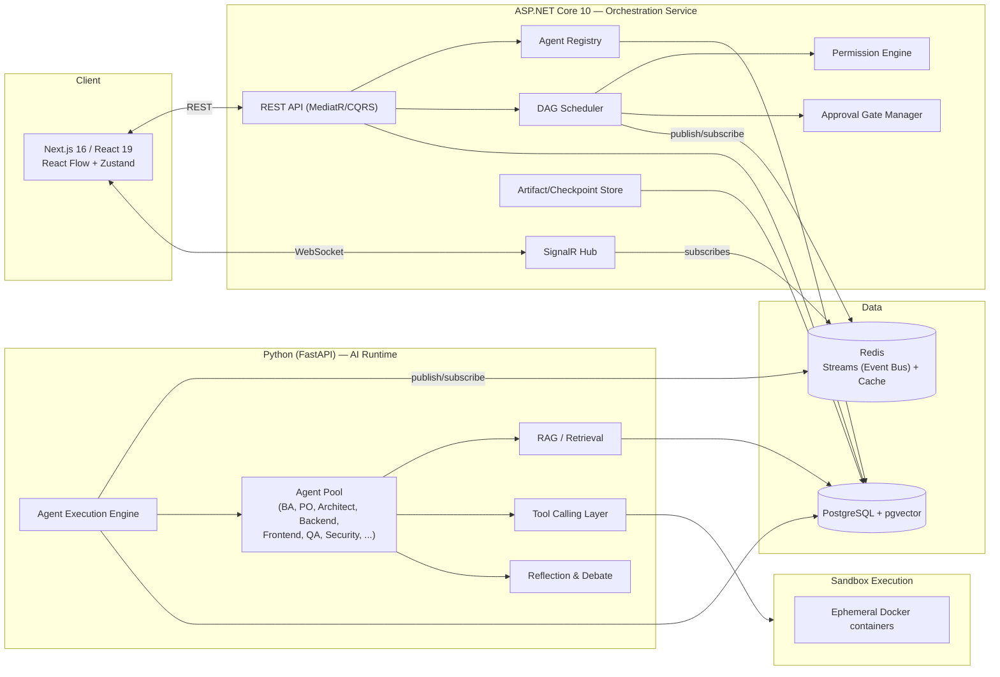

# AI Agents Team — Architecture

An autonomous AI software engineering company: a supervisor coordinates a dynamic
registry of specialized agents that plan, build, test, review, and ship software
through a DAG-scheduled workflow, communicating only through events, with human
approval gates at the stages that matter.

This document is the design reference. It intentionally does not contain code —
it defines the contracts, data model, and component boundaries so implementation
can proceed piece by piece without rework.

---

## 1. Guiding principles

- **Two runtimes, one contract.** ASP.NET Core owns orchestration, state,
  permissions, and persistence. Python/FastAPI owns everything that talks to an
  LLM (agent reasoning, RAG, tool calling, debate/reflection). They never share
  memory or call each other's internals directly — only the Event Bus and a
  narrow REST surface cross the boundary.
- **Agents are data, not code paths.** The supervisor never has an `if
  agentType == "backend"` branch. It reads a registry row and dispatches.
- **Everything is an event.** State changes propagate by publishing an event,
  never by one agent calling another. This is what makes replay, observability,
  and plugins possible.
- **Ship the core loop before the ornamentation.** Sections 15–20 (analyzers,
  advisor agents, health scoring, etc.) are additional *agents* riding on the
  same registry/workflow/event primitives — they don't require new
  infrastructure. Section 21 gives a phased build order.

---

## 2. High-level topology



**Why Redis Streams for the Event Bus, not a raw pub/sub or a full broker
(Kafka/RabbitMQ):** the system needs replay (consumer groups can re-read from
an offset) and at-least-once delivery, but not the operational weight of a
dedicated broker for a system of this size. Redis is already in the stack for
caching, so Streams reuses infrastructure you're running anyway. If throughput
or multi-datacenter fan-out ever demands it, swap the Event Bus implementation
behind its interface — nothing upstream should know it's Redis.

---

## 3. Core domain concepts

| Concept | Definition |
|---|---|
| **Workspace** | Top-level tenant/project boundary. Owns its own agents config, memory, artifacts, workflows, repositories. |
| **Repository** | A git repo registered under a workspace (backend / frontend / infra / docs — Section 19). |
| **Agent** | A registered capability, described by a manifest (Section 4), physically executed in the Python runtime. |
| **Task** | A unit of work — one DAG node. Has required context, an assigned agent, a status, confidence/risk on completion. |
| **Workflow** | A DAG of Tasks + Edges (dependencies) for one goal (e.g. "implement feature X"). |
| **Event** | An immutable fact published to the bus (`TaskCreated`, `BackendFinished`, ...). |
| **Artifact** | Any produced output (code, doc, diagram, test, SQL, Dockerfile) with version/owner/timestamp/status. |
| **Checkpoint** | A durable snapshot of workflow state at a milestone; resumable/rollback-able/forkable. |
| **Approval Gate** | A workflow node that blocks scheduling until a human decision is recorded. |

---

## 4. Dynamic Agent Registry

Agents are never hardcoded into the supervisor. Each agent — whether shipped in
core or added by a plugin — registers a manifest at startup and on a heartbeat
interval.

### 4.1 Agent manifest schema

```json
{
  "name": "backend-engineer",
  "version": "1.3.0",
  "description": "Implements backend features per Clean Architecture + CQRS conventions",
  "skills": ["dotnet", "ef-core", "cqrs", "mediatr"],
  "supportedTasks": ["ImplementBackendFeature", "WriteMigration", "FixBackendBug"],
  "priority": 50,
  "requiredContext": ["ArchitectureDoc", "TaskSpec", "RepositoryHandle:backend"],
  "producedArtifacts": ["SourceCode", "Migration", "UnitTest"],
  "dependencies": ["architecture-approved"],
  "tools": ["filesystem", "git", "dotnet-cli", "static-analysis"],
  "permissions": ["repo:backend:write", "repo:frontend:none", "deploy:none"],
  "endpoint": "http://ai-runtime:8000/agents/backend-engineer",
  "healthCheck": "http://ai-runtime:8000/agents/backend-engineer/health"
}
```

### 4.2 Registration protocol

1. Agent process (Python) calls `POST /api/registry/agents` on the .NET API
   with its manifest at boot.
2. Registry validates the manifest (schema + permission set is a subset of
   what the workspace allows), persists it, publishes `AgentRegistered`.
3. Agent sends a heartbeat (`PUT /api/registry/agents/{name}/heartbeat`) every
   N seconds; missed heartbeats flip the agent to `Unavailable` and publish
   `AgentUnavailable`, which the scheduler treats as a self-healing trigger
   (Section 9).
4. Deregistration on graceful shutdown publishes `AgentDeregistered`.

The registry is **just a table** (`agents`, `agent_capabilities`) plus this
protocol — no code changes to the supervisor are needed to add an agent, only
a new process implementing the manifest + task contract.

---

## 5. Workflow Engine — DAG execution

### 5.1 Model

- `WorkflowDefinition` — a named, versioned template (optional; workflows can
  also be generated ad hoc by the Architect/PO agents).
- `WorkflowRun` — one execution instance, status: `Planning | Running |
  WaitingApproval | Paused | Completed | Failed | RolledBack`.
- `TaskNode` — id, agent capability required (not a specific agent instance —
  resolved at dispatch time), status, inputs, outputs, confidence, risk.
- `TaskEdge` — `dependsOn` (data or ordering dependency).

### 5.2 Scheduling algorithm

The scheduler holds an in-memory (Redis-cached, Postgres-durable) view of each
active `WorkflowRun`'s DAG:

1. Compute the **ready set**: nodes whose every `dependsOn` predecessor is
   `Completed` (or `Approved`, for gate nodes) and whose node status is
   `Pending`.
2. For each ready node, resolve candidate agents from the Registry by matching
   `supportedTasks` + required `skills`, filter by `permissions`, then rank by
   `priority` and current load (fewest in-flight tasks).
3. Dispatch all ready nodes **concurrently** — this is what gives you
   Backend/Frontend/Database/Docs running in parallel: they simply have no
   edges between them, so they land in the same ready set.
4. On a node's `Completed`/`Failed` event, recompute the ready set. This is a
   standard topological/Kahn's-algorithm sweep, re-run incrementally on every
   status change rather than recomputed from scratch.
5. A node with no available agent (all `Unavailable` or none registered) stays
   `Blocked` and surfaces on the dashboard — it does not stall the rest of the
   DAG.

This lives in the .NET service as `Sched` in the diagram — a MediatR
`INotificationHandler` reacting to Redis-consumed events, not a polling loop.

---

## 6. Event Bus

### 6.1 Transport

Redis Streams, one stream per event category (or one stream with a `type`
field and consumer groups filtering — start with a single `workflow-events`
stream to keep ordering simple, split later only if a category needs
independent scaling).

### 6.2 Event envelope (shared schema, versioned)

```json
{
  "eventId": "uuid",
  "type": "BackendFinished",
  "version": 1,
  "workspaceId": "uuid",
  "workflowRunId": "uuid",
  "taskId": "uuid",
  "producedBy": "backend-engineer",
  "timestamp": "2026-07-24T12:00:00Z",
  "payload": { "...": "..." },
  "confidence": 0.86,
  "riskLevel": "low"
}
```

Both runtimes (.NET and Python) publish and consume through this envelope —
this is the *only* coupling between them.

### 6.3 Core event catalog

`TaskCreated`, `TaskDispatched`, `TaskCompleted`, `TaskFailed`,
`ArchitectureApproved`, `BackendFinished`, `FrontendFinished`,
`DatabaseFinished`, `DocsFinished`, `TestsPassed`, `TestsFailed`,
`CodeReviewApproved`, `CodeReviewRejected`, `SecurityIssueFound`,
`DeploymentStarted`, `DeploymentCompleted`, `AgentRegistered`,
`AgentUnavailable`, `ApprovalRequested`, `ApprovalGranted`,
`ApprovalDenied`, `CheckpointCreated`, `WorkflowRolledBack`.

New event types are additive (new plugin agents just publish/subscribe to new
type strings) — no central enum to modify, though a schema registry table
tracks known types + their payload JSON Schema for validation and
documentation.

---

## 7. Plugin system

A plugin is a package that can add, without touching core source:

| Extension point | Mechanism |
|---|---|
| **New agent** | Python package implementing the manifest + task HTTP contract (Section 4), deployed as its own container or added to the AI Runtime's agent pool via an entry-point (`pyproject.toml` `[project.entry-points]`), auto-registers on boot. |
| **New tool** | Entry in the Tool Marketplace (Section 8) — a manifest + an implementation behind a common `ITool`/`Tool` interface, loaded via .NET `AssemblyLoadContext` (for .NET-hosted tools like `git`, `filesystem`) or Python entry-points (for AI-runtime-hosted tools). |
| **New workflow** | A `WorkflowDefinition` JSON/YAML template dropped into a watched folder or POSTed to `/api/workflows/definitions` — no redeploy needed. |
| **New memory provider** | Implements `IVectorStore`/`IMemoryProvider` (Section 14) — default is pgvector; a plugin could add Pinecone/Qdrant by implementing the interface and registering it in config. |

Core principle: **the core never imports a plugin.** Plugins register
themselves against interfaces/manifests the core already exposes; discovery is
runtime (DB row / entry-point scan / directory watch), never a compile-time
reference from core to plugin code.

---

## 8. Tool Marketplace & permissions

Tools are registered the same way agents are — a manifest:

```json
{
  "name": "git",
  "description": "Git operations scoped to a repository handle",
  "operations": ["clone", "branch", "commit", "diff", "push"],
  "requiresPermission": "repo:{repoId}:write",
  "sandboxed": false
}
```

Agents *request* tools by name at task-execution time; the AI Runtime's Tool
Calling Layer checks the requesting agent's `permissions` (from its manifest)
against the tool's `requiresPermission` before granting access. Denials
publish `ToolAccessDenied` and are visible in the dashboard — this is the
enforcement point for the Permission System example rules ("QA cannot modify
production code", "Reviewer cannot deploy", "DevOps cannot edit business
logic"): those are just permission-string patterns an agent's manifest either
does or doesn't include, checked centrally, not per-agent-implementation trust.

Standard tool set to ship first: `filesystem`, `git`, `terminal` (sandboxed),
`docker`, `code-formatter`, `static-analysis`. `browser`, `search`,
`database`, `api-testing` follow once the core loop works.

---

## 9. Human approval gates & checkpoints

### 9.1 Approval gates

A `TaskNode` can be flagged `requiresApproval: true` (Architecture,
Deployment, Major Refactoring, Database Migration are the defaults from the
spec, configurable per workflow). When such a node becomes ready:

1. Scheduler sets it to `WaitingApproval`, publishes `ApprovalRequested`.
2. SignalR pushes this to the frontend; the DAG view (React Flow) highlights
   the node.
3. A human calls `POST /api/workflows/{runId}/nodes/{nodeId}/approve` or
   `/reject` with optional notes.
4. `ApprovalGranted` unblocks the node for normal dispatch; `ApprovalDenied`
   marks it `Failed` and the workflow either stops or routes to a
   remediation branch, depending on the workflow definition.

The scheduler genuinely pauses — it does not poll; it is idle until the
approval event arrives, same as waiting on any other dependency.

### 9.2 Checkpoints

Every completed milestone node (and every gate decision) writes a
`Checkpoint`: a serialized snapshot of `WorkflowRun` + all `TaskNode` states +
artifact references at that instant. Checkpoints support:

- **Resume** — restart the scheduler loop from the latest checkpoint after a
  process restart.
- **Rollback** — restore `WorkflowRun` state to an earlier checkpoint,
  discarding later task results (artifacts are versioned, not deleted — see
  Section 15).
- **Replay** — re-run from a checkpoint with the same inputs (deterministic
  replay for debugging) — see Section 22.
- **Fork** — clone the run from a checkpoint into a new `WorkflowRunId`,
  letting two branches diverge (e.g., try two architectural approaches).

---

## 10. Self-healing workflow

On `TaskFailed`:

1. Scheduler checks `attempt count` vs. a per-task-type retry policy
   (default 2 retries, exponential backoff).
2. If retries remain, re-dispatch to the **same** agent instance if it's
   healthy, else re-resolve candidate agents from the Registry (this is the
   "assign another capable agent" path — e.g., a second `backend-engineer`
   replica, or a differently-versioned agent that supports the same task).
3. If no capable agent is available or retries are exhausted, the node goes
   `Blocked`/`Failed`, a `TaskFailed` (terminal) event fires, and — if the
   workflow marks the task non-critical — the DAG continues around it;
   otherwise the run goes to `Failed` and surfaces for human intervention.

This is why failures "never crash the workflow": the scheduler treats a
failure as a state transition to react to, not an exception that unwinds the
process.

---

## 11. Confidence scoring, reflection & debate

### 11.1 Confidence scoring

Every agent response (in the Python runtime) includes a structured tail:

```json
{
  "result": { "...": "..." },
  "confidence": 0.72,
  "riskLevel": "medium",
  "reasoningSummary": "Implemented per spec; uncertain about pagination edge case at boundary=0",
  "estimatedCompletion": 0.9
}
```

This rides in the event payload (Section 6.2) and is used by the scheduler:
below a configurable confidence threshold (default 0.6), the scheduler does
not mark the task simply `Completed` — it routes to **Debate Mode** before
acceptance.

### 11.2 Reflection loop

Standard per-agent execution shape, enforced by the AI Runtime's Agent
Execution Engine wrapper (not each agent reimplementing it):
**Plan → Execute → Critique → Improve → Final Answer.** The Critique step is
the same agent (or a lightweight critic prompt) checking its own output
against the task spec before returning; this happens inside one task's
execution, before the confidence-scored result is published.

### 11.3 Debate mode

When confidence is low: the Execution Engine dispatches the same task to a
second agent (or the same agent with an alternate prompt/temperature),
collects both results, and a designated **Reviewer agent** receives both plus
the original spec and returns a decision + a fused/chosen result. This is a
task subgraph, not new infrastructure — modeled as three extra `TaskNode`s
(`DebateA`, `DebateB`, `ReviewerDecision`) inserted dynamically by the
scheduler when the low-confidence condition triggers.

---

## 12. Context management

Handled entirely in the Python AI Runtime, per agent invocation:

- **Sliding window** — most recent N turns/messages kept verbatim.
- **Context compression** — older turns summarized (a cheap/fast model call)
  and stored as a `ContextSummary` artifact, referenced instead of replayed
  in full.
- **Long-term recall / relevant retrieval** — before invoking an agent, the
  Execution Engine queries Vector Memory (Section 13) for the top-K relevant
  prior decisions/artifacts for this workflow/workspace and injects them as
  context, rather than replaying entire history.

This keeps `requiredContext` (from the agent manifest, Section 4.1) resolvable
without every task carrying the full project history.

## 13. Vector memory & knowledge graph

### 13.1 Vector memory (pgvector)

One `memory_items` table: `id, workspace_id, kind (requirement | architecture
| code | doc | decision | lesson_learned), content, embedding vector(1536),
source_artifact_id, created_at`. Retrieval is a standard cosine-similarity
`ORDER BY embedding <=> query_embedding LIMIT k`, scoped by `workspace_id` and
optionally `kind`. Embeddings are produced in the Python runtime (provider
determined by the workspace's configured AI provider — Section 20) and
written back to Postgres via the .NET API or directly by the Python service
(both hold a connection; the .NET side owns schema migrations).

### 13.2 Knowledge graph

Rather than standing up a separate graph database, model it relationally in
the same Postgres instance: a `graph_nodes` table (`id, workspace_id, type:
Feature|Class|Module|Agent|Task|Requirement, ref_id, label`) and a
`graph_edges` table (`from_node_id, to_node_id, relation:
implements|depends_on|owns|produced_by|tests`). This is enough for
"what implements requirement X", "what does module Y depend on", "which agent
produced this class" queries via recursive CTEs, without adding Neo4j/AGE
operational cost. Revisit only if graph queries become a proven bottleneck.

---

## 14. Artifact management & prompt versioning

### 14.1 Artifacts

`artifacts` table: `id, workspace_id, workflow_run_id, task_id, type (code |
markdown | image | diagram | json | test | dockerfile | sql), owner_agent,
version, status (draft | final | superseded), storage_ref, created_at`.
Content itself: small text artifacts inline in Postgres; larger/binary
artifacts (images, built packages) in object storage (local disk volume or
S3-compatible MinIO in Docker Compose) referenced by `storage_ref`. New
versions of the same logical artifact increment `version` and link via
`previous_version_id` — nothing is overwritten, which is what makes the Code
Diff Engine (Section 17.2) and Rollback (Section 9.2) possible.

### 14.2 Prompt versioning

`prompt_templates` table: `id, name, version, content, variables_schema,
created_at, superseded_by`. Every agent invocation records which
`prompt_template_id + version` it used, alongside the run's outcome
(confidence, success/failure, human approval result). This is what "Rollback"
and "Experiment Tracking" mean concretely: revert to an earlier
`prompt_templates` row, or A/B two versions across workflow runs and compare
downstream confidence/approval rates.

---

## 15. Execution history, replay & observability

### 15.1 Execution history

Every `WorkflowRun` persists its full event stream (already durable in Redis
Streams, additionally archived to a Postgres `workflow_events` table for
long-term/queryable storage past Redis's retention window) — this alone
gives you timeline, agent decisions, and failures. Token usage/cost per event
is attached to the `TaskCompleted` payload and mirrored into a
`token_usage` table keyed by `agent, model, task_id, workflow_run_id`.

### 15.2 Execution replay

Replaying from a checkpoint (Section 9.2) means: load the checkpoint's
`WorkflowRun`/`TaskNode` state, then re-run the scheduler loop forward,
re-dispatching tasks that were `Pending`/`Running` at that point. Because
inputs to each task are recorded artifacts (not live/mutable state), replay
is deterministic modulo the LLM call itself — record the raw agent
response too, so a "replay" can either **re-execute** (new LLM calls,
useful for testing agent changes) or **re-play recorded responses**
(useful for debugging the orchestration logic itself, with zero API cost).

### 15.3 Observability dashboard

A Next.js page reading aggregate views over `workflow_events` +
`token_usage` (materialized views refreshed on a schedule, or computed
on-demand for a given date range): latency per task type, failure/retry
rates per agent, cost and execution time trends, agent utilization
(% of heartbeat interval spent `Busy` vs `Idle`). No separate
Prometheus/Grafana stack for v1 — the data already lives in Postgres and the
dashboard is just another authenticated page; add an OpenTelemetry exporter
later only if external alerting is needed.

---

## 16. Sandbox execution, diff engine & PR generation

### 16.1 Sandbox execution

Generated code that must actually run (tests, build verification, a
security/perf agent executing a snippet) runs in an ephemeral Docker
container spun up by the AI Runtime's Tool Calling Layer via the `docker`
tool — one container per execution, no persistent state, resource-limited
(CPU/memory/time), network-disabled by default unless the task explicitly
needs it (e.g., `npm install`), destroyed after result capture. This is the
enforcement boundary for "generated code executes inside isolated sandboxes."

### 16.2 Code diff engine

Because every artifact is versioned (Section 14.1), a diff is just
`diff(artifact.version[n].content, artifact.version[n-1].content)` — computed
on demand (a standard text/AST diff library) when the frontend requests a
comparison, not precomputed/stored. "Highlight regressions" is a
Security/Performance-analyzer-agent task that runs against the diff and
annotates it, rather than a separate engine.

### 16.3 Auto PR generation

A `DevOpsAgent`/`GitAgent` task, triggered on `CodeReviewApproved`: composes
commit messages from the task's spec + diff, opens a PR via the `git` tool
(and a GitHub/GitLab API tool), and generates the PR description +
changelog entry from the workflow's `TaskNode` history for that feature.
This is an agent + tool combination, not new core infrastructure.

---

## 17. Analyzer & advisor agents

These are all **just agents** registered like any other (Section 4) — they
require no new infrastructure, only new manifests + Python implementations:

| Agent | Task type(s) | Notes |
|---|---|---|
| Security Analyzer | `ScanSecurity` | Wraps static tools (Semgrep, `dotnet list package --vulnerable`, `npm audit`) as the `static-analysis` tool; checks secrets, SQLi, XSS, CSRF, auth issues, dependency CVEs. |
| Performance Analyzer | `AnalyzePerformance` | Reviews DB query plans, algorithmic complexity of diffed code, API latency budgets, caching opportunities. |
| Architecture Validator | `ValidateArchitecture` | Checks Clean Architecture layer boundaries, SOLID violations, DDD/CQRS conventions against the Architect agent's approved design doc. |
| Tech Stack Advisor | `RecommendStack` | Consulted during planning; outputs a recommendation artifact the Architect agent consumes. |
| UX Review Agent | `ReviewUX` | Runs against rendered frontend output/screenshots; checks accessibility, responsiveness, consistency. |
| Business Analyst Agent | `DiscoverRequirements`, `GapAnalysis` | Produces user stories + acceptance criteria feeding the DAG's root nodes. |
| Product Owner Agent | `Prioritize`, `PlanSprint` | Orders the backlog that becomes workflow generation input. |

Each publishes its findings as an `Artifact` (type `json`/`markdown`) and, for
blocking findings, a `CodeReviewRejected`/`SecurityIssueFound` event that the
scheduler can route back to the originating agent for remediation (a new
`TaskNode` inserted as a dependency-of the next gate).

---

## 18. Project health score

Computed on demand (or nightly, cached) from existing data — no new pipeline:

```
health = weighted_avg(
  architecture:    (ArchitectureValidator findings, weight 0.20),
  security:        (SecurityAnalyzer findings, weight 0.20),
  performance:     (PerformanceAnalyzer findings, weight 0.15),
  testing:         (test coverage / TestsPassed ratio, weight 0.15),
  maintainability: (avg code review confidence + complexity, weight 0.10),
  documentation:   (DocsFinished coverage vs. features, weight 0.10),
  scalability:     (PerformanceAnalyzer scalability subset, weight 0.10)
)
```

Stored as a `project_health_snapshots` row per workspace per computation,
so the dashboard can show trend over time, not just current score.

---

## 19. Multi-workspace & multi-repository

- **Workspace** is the tenant boundary: `workspace_id` is a foreign key on
  every table introduced above (agents config overrides, memory, artifacts,
  workflows). Two workspaces share the same running services but zero data.
- **Repository** is a child of workspace: `repositories` table
  (`id, workspace_id, kind: backend|frontend|infra|docs, git_url,
  default_branch, local_clone_ref`). Agents request a `RepositoryHandle` by
  kind as part of `requiredContext`; the `git`/`filesystem` tools resolve it
  to an actual clone path (one working copy per repository per active
  workflow run, to keep parallel Backend/Frontend/Infra tasks from
  colliding).

---

## 20. RAG documentation search & AI providers

### 20.1 RAG

A `documentation_sources` table (`workspace_id, source_type: official_docs |
project_docs | internal_kb | codebase, uri_or_ref`) feeds an ingestion job
(Python) that chunks + embeds into the same `memory_items` table (Section
13.1) with `kind='doc'`. Agents call the RAG retrieval endpoint before
answering; it's the same retrieval path as long-term memory recall, just
scoped to `kind='doc'` and (optionally) a specific `source_type`.

### 20.2 Multi-provider AI

The Python AI Runtime abstracts model calls behind one interface
(`complete(messages, tools, model_ref) -> Response`) with adapters for
OpenAI, Claude (Anthropic), Gemini, and Ollama. `model_ref` is workspace/agent
configurable (e.g., "use Claude for the Architect agent, Ollama for cheap
internal drafts, OpenAI for embeddings") — provider choice is config, not
a code branch per agent.

---

## 21. Deployment topology (Docker Compose)

```yaml
services:
  postgres:      # PostgreSQL + pgvector extension
  redis:         # Event Bus (Streams) + cache
  api:           # ASP.NET Core 10 orchestration service
  ai-runtime:    # Python FastAPI — agent pool, RAG, tool calling
  frontend:      # Next.js 16
  # sandbox containers are spawned on-demand by ai-runtime via the docker tool,
  # not declared as standing services
```

`api` and `ai-runtime` are both stateless and horizontally scalable — all
shared state lives in `postgres`/`redis`, which is what allows "assign
another capable agent" (Section 10) to mean routing to a different replica of
the same container, not a manual failover.

---

## 22. Key data model (entities, not full DDL)

```
Workspace, Repository
Agent (registry row), AgentCapability
WorkflowDefinition, WorkflowRun, TaskNode, TaskEdge
Event (archived), Checkpoint
Artifact, ArtifactVersion
PromptTemplate
MemoryItem (pgvector)
GraphNode, GraphEdge
TokenUsage
ProjectHealthSnapshot
Permission (agent -> permission string bindings)
DocumentationSource
```

All FK-scoped by `WorkspaceId`. Owned by the .NET service (EF Core
migrations); the Python runtime reads/writes through the same Postgres
instance using SQLAlchemy models kept in sync with the .NET-owned schema
(schema is a shared contract — .NET migrations are the source of truth,
Python models mirror them).

---

## 23. API surface (representative, not exhaustive)

**REST (.NET, CQRS via MediatR)**
```
POST   /api/workspaces
POST   /api/workspaces/{id}/repositories
POST   /api/registry/agents                      # agent self-registration
PUT    /api/registry/agents/{name}/heartbeat
POST   /api/workflows/definitions
POST   /api/workflows/runs                       # start a run
GET    /api/workflows/runs/{id}                  # DAG + statuses
POST   /api/workflows/runs/{id}/nodes/{nodeId}/approve
POST   /api/workflows/runs/{id}/nodes/{nodeId}/reject
POST   /api/workflows/runs/{id}/checkpoints/{checkpointId}/rollback
POST   /api/workflows/runs/{id}/checkpoints/{checkpointId}/fork
GET    /api/artifacts/{id}/versions
GET    /api/artifacts/{id}/diff?from=v1&to=v2
GET    /api/observability/dashboard?workspaceId=&from=&to=
GET    /api/health-score/{workspaceId}
```

**SignalR hub**: `/hubs/workflow` — pushes `TaskStatusChanged`,
`ApprovalRequested`, `AgentAvailabilityChanged` to subscribed clients scoped
by `workflowRunId`/`workspaceId`.

**Python FastAPI (internal, called by the .NET Execution dispatcher)**
```
POST /agents/{name}/invoke        # { taskId, context, tools[] } -> agent result envelope
GET  /agents/{name}/health
POST /rag/query
POST /memory/query
POST /memory/write
```

---

## 24. Phased build order

This full system is not a single build. Recommended order, each phase
independently useful and demoable:

1. **Core loop** — Agent Registry + Event Bus (Redis Streams) + DAG
   Scheduler + 2–3 real agents (e.g. Architect, Backend, QA) + Postgres
   schema for Workflow/Task/Agent + minimal Next.js DAG viewer (read-only).
2. **Human-in-the-loop** — Approval Gates + Checkpoints + SignalR live
   updates + resume-after-restart.
3. **Memory & context** — pgvector Vector Memory + context compression +
   RAG documentation search.
4. **Resilience** — Self-healing retries/reassignment + confidence scoring +
   reflection loop + debate mode.
5. **Artifacts & history** — Artifact versioning + prompt versioning +
   execution history + replay.
6. **Extensibility** — Plugin system + Tool Marketplace + permission
   enforcement made strict (start permissive, tighten once real agents
   exist).
7. **Quality & delivery agents** — Security/Performance/Architecture
   analyzers, Diff Engine, Sandbox execution, Auto PR generation.
8. **Product-facing agents** — BA, PO, Tech Stack Advisor, UX Review, Project
   Health Score.
9. **Scale-out** — Multi-workspace, multi-repository, observability
   dashboard, cost tracking depth, knowledge graph queries.

Steps 7–9 are where the "Final Output" engineering report (spec's closing
section) becomes assemblable — it's a query/rollup over data every prior
phase already produces (artifacts, events, health score, docs), not a new
subsystem.

---

## 25. Open questions to resolve before Phase 1 starts

1. **Auth model** — who logs into the frontend, and how do workspace/agent
   permissions map to human users vs. service-to-service (API ↔ AI Runtime)
   auth? (Suggest: ASP.NET Identity or an external IdP for humans; a shared
   internal API key or mTLS between `api` and `ai-runtime` for
   service-to-service.)
2. **Object storage** — local Docker volume vs. MinIO/S3 for large artifacts,
   from day one or deferred to Phase 5?
3. **Which 2–3 agents make up the Phase 1 demo?** Suggest Architect →
   Backend → QA as the smallest loop that proves DAG + parallelism +
   registry end-to-end.
4. **Sandbox isolation depth** — is Docker-out-of-Docker on the same host
   acceptable for Phase 7, or does sandbox execution need to run on
   separate, network-isolated infrastructure from day one (a security
   requirement worth locking down early rather than retrofitting)?
