# Architecture Extension — Autonomous AI Software Engineering Company (v2)

**Status of this document:** an *addendum* to [ARCHITECTURE.md](ARCHITECTURE.md).
`ARCHITECTURE.md` remains the source of truth for every subsystem it defines
(§1–§25) and is **not modified**. Every section below (`E1`–`E16`) adds a new
capability layer on top of existing components, or deepens an existing
section without changing its contract. Where a new table adds columns to an
existing table, existing columns/rows are untouched and new columns are
nullable/defaulted — no existing consumer breaks.

Numbering convention: `§n` refers to `ARCHITECTURE.md`; `En` refers to this
document. Cross-references are explicit in every section's "Interaction with
Existing Components" subsection.

---

## E0. Compatibility matrix

| New subsystem | Extends (§) | Adds tables | Adds events | Replaces |
|---|---|---|---|---|
| E1 Supervisor Brain | §5 (Workflow Engine), §10 (Self-Healing), §11 (Confidence/Debate) | `supervisor_decisions`, `execution_strategies` | `SupervisorDirectiveIssued`, `SupervisorReplanRequested`, `SupervisorStrategySelected` | nothing — §5.2 scheduler kept verbatim as execution layer |
| E2 Intent Engine | §17 (BA/PO agents), pre-§5 | `intent_sessions`, `clarification_answers` | `IntentAnalysisStarted`, `ClarificationRequested`, `ClarificationAnswered`, `RequirementsStructured`, `ProjectClassified` | nothing — new phase before `WorkflowRun` creation |
| E3 Hierarchical Task Planner | §5.1 (`TaskNode`) | none (adds columns) | `TaskLevelPlanned` | nothing — flat tasks are `level=Task` by default |
| E4 Execution Graph | §13.2 (Knowledge Graph), §4 (React Flow in stack) | none (extends enums) | `GraphNodeAdded`, `GraphEdgeAdded` | nothing — additive enum values |
| E5 Multi-Layer Memory | §12 (Context Mgmt), §13.1 (Vector Memory) | none (adds columns to `memory_items`) | `MemoryWritten`, `MemoryPromoted`, `MemoryExpired`, `MemorySummarized` | nothing |
| E6 Reasoning Engine | §11.2 (Reflection Loop) | `reasoning_traces` | `ReasoningStageCompleted` | supersedes §11.2's 5-stage loop with a 12-stage superset (old stages are a named subset) |
| E7 Multi-Model Router | §20.2 (provider abstraction) | `model_routing_policies` (extends `token_usage`) | `ModelSelected`, `ModelFallbackTriggered` | nothing — router sits inside existing `complete()` interface |
| E8 Agent Collaboration Protocol | §6 (Event Bus), §11.3 (Debate Mode) | `agent_messages` | `Ask`,`Reply`,`Delegate`,`Broadcast`,`Debate`,`Vote`,`Consensus`,`Escalate`,`Reject`,`RequestReview`,`TransferOwnership` | reframes §11.3 as one usage pattern of this protocol, doesn't change §11.3's behavior |
| E9 Workflow Template Library | §5.1 (`WorkflowDefinition`) | `workflow_templates` | `TemplateInstantiated` | nothing — templates are a generator for existing `WorkflowRun`/`TaskNode` rows |
| E10 Learning Engine | §14.2 (Prompt Versioning), §15.1 (Execution History) | `lessons_learned`, `agent_scores`, `prompt_optimization_runs` | `LessonExtracted`, `AgentScoreUpdated`, `PromptOptimized` | nothing |
| E11 Observability 2.0 | §15.3 (Dashboard) | none (new views only) | none | nothing — new panels over existing + new (E-series) data |
| E12 AI Governance | §8 (Permissions), §14.2 (Prompt Versioning) | `governance_policies`, `budget_policies` | `PolicyViolationDetected`, `BudgetThresholdReached` | nothing — adds a check layer consulted by §8's existing enforcement point |
| E13 Agent Marketplace | §7 (Plugin System), §8 (Tool Marketplace) | `marketplace_listings`, `installed_packages` | `PackagePublished`, `PackageInstalled` | nothing — §8 Tool Marketplace becomes the tool-type subset of E13's catalog |
| E14 Autonomous Improvement Loop | §9.2 (Checkpoints), invokes E10 | none (a `WorkflowDefinition` row, per §5.1) | `ImprovementLoopStarted`, `ImprovementLoopCompleted` | nothing — expressed as an ordinary DAG using §5's own engine |
| E15 Project Health Intelligence | §18 (Project Health Score) | none (adds columns to `project_health_snapshots`) | `HealthScoreComputed` | nothing — old weighted formula becomes a subset of the new one |
| E16 Future Distributed Execution | §21 (Deployment Topology), §4.2 (agent `endpoint`) | none now (documents future `region` field) | none now | nothing — clarifies why §21's stateless design already supports this |

---

## E1. Supervisor Brain

### Purpose
Elevate the Supervisor from a mechanical scheduler into an executive
reasoning agent that owns *why* and *what*, while the existing DAG Scheduler
(§5.2) continues to own *how* — the mechanical dispatch of ready nodes to
agents. This is a layering change, not a replacement: §5.2's algorithm
(compute ready set → resolve candidates → dispatch → recompute on
completion) is unmodified and still runs exactly as documented.

### Responsibilities
- Understand business goals (consumes E2 Intent Engine output)
- Generate execution plans and build DAGs dynamically (drives E3/E9)
- Choose execution strategies (parallel-aggressive vs. conservative-serial,
  cost-optimized vs. speed-optimized)
- Assign agents (overrides/refines §5.2's candidate ranking when it has
  higher-level context the mechanical ranking lacks)
- Resolve conflicts between agents (consumes E8 protocol events)
- Detect failures and replan (consumes §10 self-healing signals, decides
  *whether* to retry vs. reassign vs. replan the remaining DAG, rather than
  §10's fixed retry-policy table making that call alone)
- Decide when Debate Mode (§11.3) triggers, beyond the fixed confidence
  threshold — using workflow-level context (e.g., a low-risk task's low
  confidence may not warrant debate; a high-risk task's medium confidence
  might)
- Optimize execution (reorders/batches ready-set dispatch for cost/latency)
- Learn from previous executions (consumes E10 Learning Engine outputs)

### Architecture

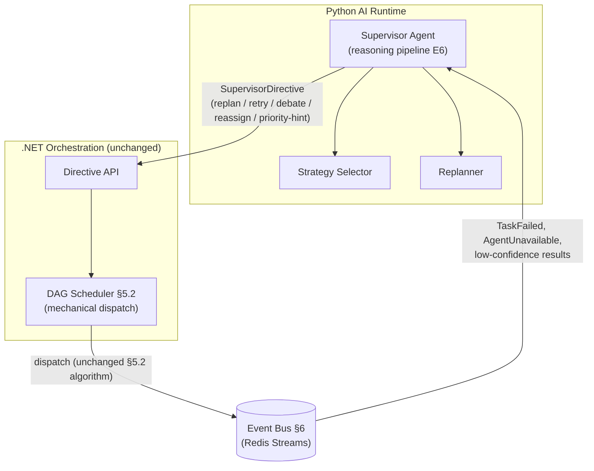

The Supervisor Agent is itself a registered agent (§4 manifest,
`supportedTasks: ["Supervise"]`), invoked through the same reasoning pipeline
as every other agent (E6) — it is not special-cased infrastructure, which is
what keeps it swappable/pluggable (e.g., a workspace could register an
alternate Supervisor implementation).

### Data Model Changes
- `supervisor_decisions(id, workflow_run_id, decision_type: replan|retry|
  reassign|debate|strategy_selection, input_snapshot jsonb, rationale text,
  confidence, created_at)` — audit trail of every executive decision.
- `execution_strategies(id, name, description, applicability_rules jsonb)` —
  e.g., `cost-optimized`, `latency-optimized`, `max-parallelism`.

### API Changes
- `POST /api/supervisor/directives` (internal, AI Runtime → .NET): `{
  workflowRunId, directiveType, targetNodeIds[], parameters }`.
- `GET /api/supervisor/decisions/{workflowRunId}` — decision audit trail for
  the frontend timeline (E11).

### Events
`SupervisorDirectiveIssued`, `SupervisorReplanRequested`,
`SupervisorStrategySelected` — all riding the standard envelope (§6.2).

### Database Changes
Two new additive tables, no changes to existing `workflow_run` / `task_node`
schemas. Migration is a single forward-only script.

### Frontend Changes
New "Supervisor Timeline" panel (React) showing directives issued alongside
the existing DAG view — a filtered read of `supervisor_decisions`.

### Interaction with Existing Components
- Reads from: §6 Event Bus, §11.1 confidence scores, §10 failure events.
- Writes to: §5.2 Scheduler via the new Directive API only — the Scheduler's
  public contract (react to ready-set changes, dispatch to Registry-resolved
  agents) is untouched, so any code already built against §5.2 keeps working
  even if the Supervisor is disabled (directives are advisory overlays; the
  Scheduler has safe defaults if no directive arrives, exactly as it does
  today per §5.2/§10).

### Deployment Impact
Supervisor Agent runs as one more agent process in the existing `ai-runtime`
service (§21) — no new container. Optional dedicated replica for isolation
under load.

### Migration Impact
Purely additive tables + one new internal API route. Existing workflows that
never receive a directive behave exactly as documented in §5.2/§10 today.

### Sequence Diagram

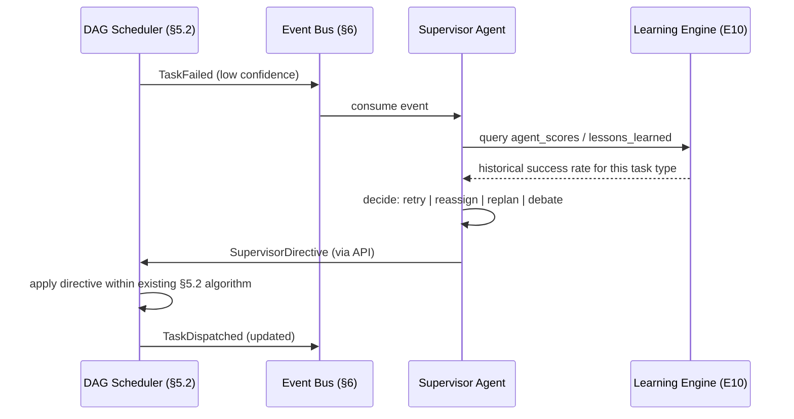

### Class Diagram

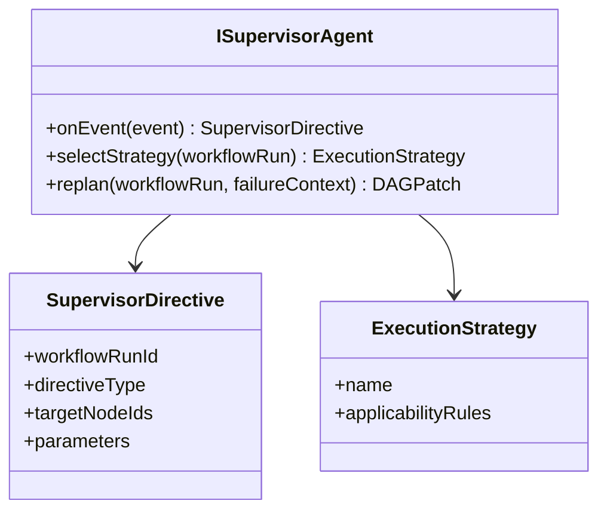

### Folder Structure Updates
```
ai-runtime/
  agents/
    supervisor/
      reasoning.py        # uses shared E6 pipeline
      strategy_selector.py
      replanner.py
api/
  Application/Supervisor/
    Commands/IssueDirectiveCommand.cs
    Queries/GetDecisionsQuery.cs
```

### Risk Analysis
| Risk | Mitigation |
|---|---|
| Supervisor becomes a single point of failure for all decisions | Directives are advisory; §5.2/§10 defaults keep the DAG moving if Supervisor is down (already-documented self-healing behavior is unchanged) |
| Conflicting directives vs. concurrent human approval decisions (§9.1) | Directive API rejects directives targeting nodes in `WaitingApproval` state — human gates always take precedence |

### Scalability Considerations
Supervisor decision-making is per-`workflowRunId` and stateless between
invocations (reads from Postgres/Redis) — horizontally scalable exactly like
every other agent (§21).

---

## E2. Intent Engine

### Purpose
Insert a formal requirement-understanding phase *before* any `WorkflowRun`
(§5.1) or Agent Registry dispatch happens, so the DAG that eventually gets
built (E3/E9) is generated from structured, validated, disambiguated
requirements rather than raw user text.

### Responsibilities
Requirement understanding, goal extraction, business analysis, risk
detection, complexity analysis, requirement validation, ambiguity detection,
clarification-question generation, project classification (CRUD / SaaS / AI
System / Microservices / Mobile App / Game / Enterprise / Dashboard).

### Architecture

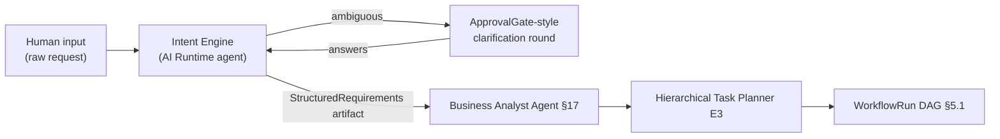

Modeled the same way §9.1 Approval Gates pause the scheduler: the
`intent_sessions` row has its own `status` state machine
(`Analyzing → AwaitingClarification → Structured`), independent of any
`WorkflowRun` (none exists yet at this point).

### Data Model Changes
- `intent_sessions(id, workspace_id, raw_input, extracted_goals jsonb,
  project_classification, complexity_score, risk_flags jsonb,
  ambiguities jsonb, status, structured_requirements_artifact_id, created_at)`
- `clarification_answers(id, intent_session_id, question, answer, answered_at)`

### API Changes
- `POST /api/intent/sessions` — start analysis on raw input.
- `POST /api/intent/sessions/{id}/answers` — submit clarification answers.
- `GET /api/intent/sessions/{id}` — poll status / retrieve structured result.

### Events
`IntentAnalysisStarted`, `ClarificationRequested`, `ClarificationAnswered`,
`RequirementsStructured`, `ProjectClassified`.

### Database Changes
Two new tables; `StructuredRequirements` is stored as an `Artifact`
(§14.1 — `type: json`, `owner_agent: intent-engine`), so no new artifact
storage mechanism is needed.

### Frontend Changes
New "Intake" page (Next.js) preceding the DAG viewer: a chat-like form for
raw input, a clarification Q&A step (rendered like the existing Approval
Gate UI, §9.1), then a read-only structured-requirements summary before
"Generate Workflow" hands off to E9.

### Interaction with Existing Components
- Produces the artifact that seeds §17's Business Analyst / Product Owner
  agents' `requiredContext` — those agents' manifests (§4.1) simply add
  `"StructuredRequirements"` to `requiredContext`.
- `ProjectClassified` selects a matching entry from the Workflow Template
  Library (E9).

### Deployment Impact
One more agent in `ai-runtime` (§21) — no new service.

### Migration Impact
Fully additive and optional: a `WorkflowRun` can still be created directly
via `POST /api/workflows/runs` (§23) without an `intent_sessions` row, for
programmatic/CI-triggered workflows that already have structured input.

### Sequence Diagram

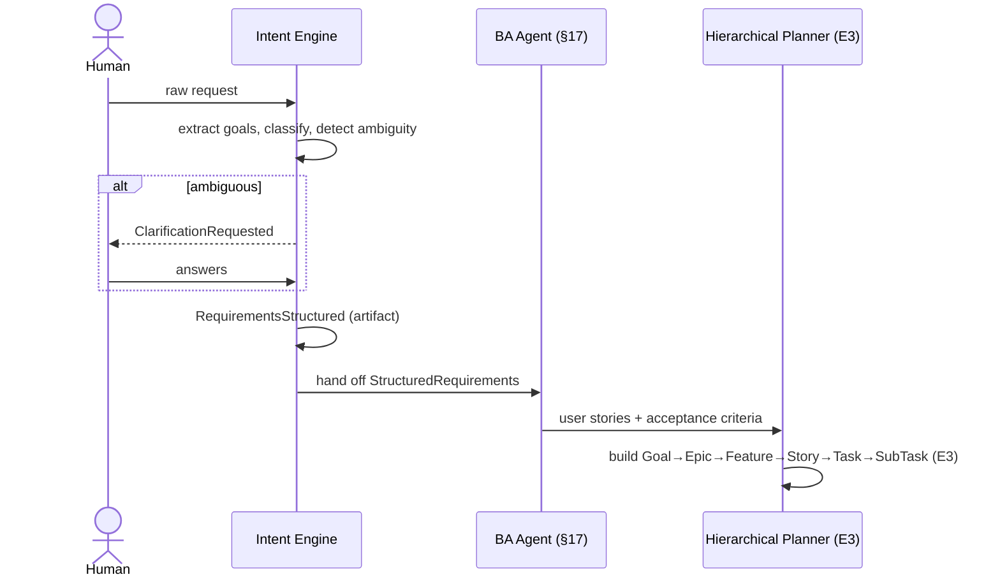

### Class Diagram

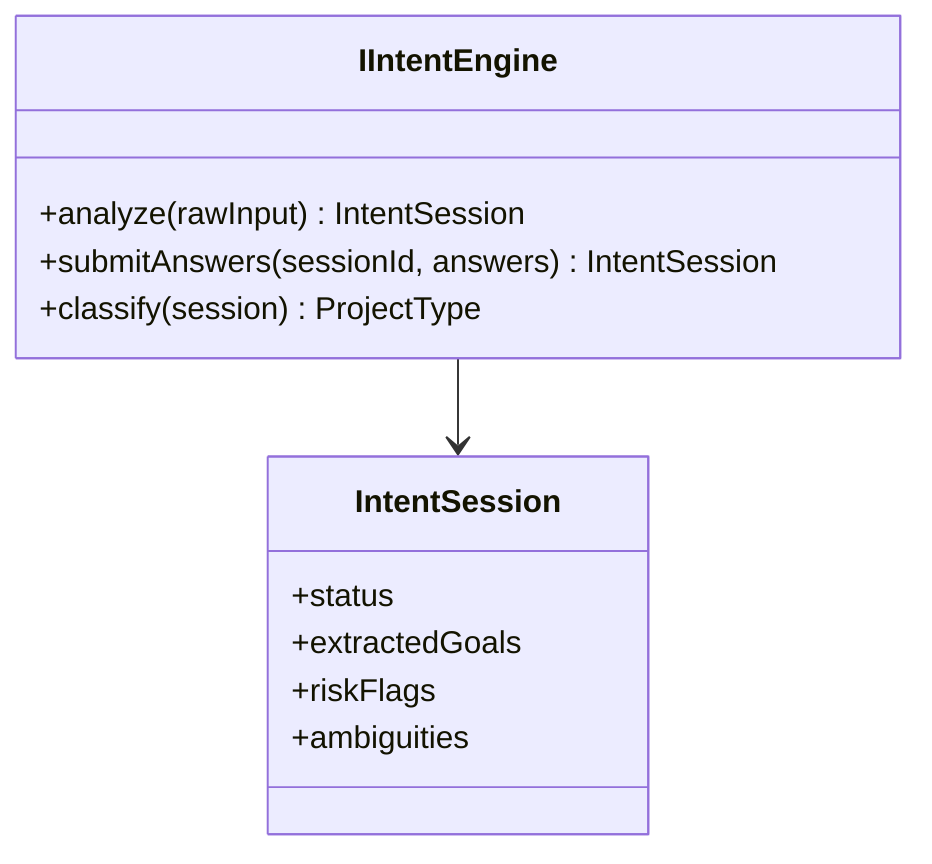

### Folder Structure Updates
```
ai-runtime/
  agents/
    intent_engine/
      goal_extraction.py
      ambiguity_detector.py
      project_classifier.py
```

### Risk Analysis
| Risk | Mitigation |
|---|---|
| Over-eager clarification loops stall project start | Cap clarification rounds (default 2); beyond that, proceed with documented assumptions logged to `risk_flags` |

### Scalability Considerations
One `intent_sessions` row per project kickoff — negligible volume; no
scaling concerns distinct from any other agent invocation.

---

## E3. Hierarchical Task Planner

### Purpose
Replace flat task-list thinking with a strict hierarchy — Goal → Epic →
Feature → User Story → Task → SubTask — while keeping the existing
`TaskNode`/`TaskEdge` (§5.1) as the *only* execution primitive the Scheduler
(§5.2) understands, so no scheduler change is required.

### Responsibilities
Decompose `StructuredRequirements` (E2) into the six-level hierarchy;
preserve dependencies at every level; ensure every `SubTask` is a normal,
schedulable `TaskNode`.

### Architecture
The hierarchy is modeled as **the same `TaskNode` table**, extended with a
`level` and `parent_node_id`. The Scheduler only ever dispatches leaf-level
nodes (`SubTask`/`Task` with no children) — higher levels (`Goal`..`Story`)
are container nodes whose status is *derived* (rolled up from children:
`Completed` when all children `Completed`, `Failed` if any child terminally
fails without recovery). This means §5.2's ready-set computation is
unchanged: it already only considers `Pending` nodes with satisfied
`dependsOn`, and container nodes are simply never given `Pending` status
directly — they're computed, not scheduled.

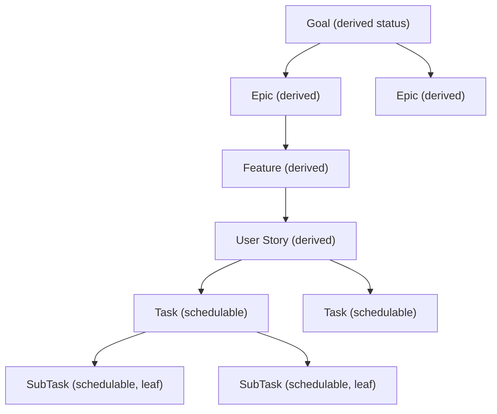

### Data Model Changes
`TaskNode` (§5.1) gains: `level enum(Goal|Epic|Feature|UserStory|Task|
SubTask) default 'Task'`, `parent_node_id uuid nullable references
task_node(id)`. Both nullable/defaulted — existing flat rows (level implicit
= Task, parent null) remain valid and behave exactly as before.

### API Changes
`GET /api/workflows/runs/{id}/hierarchy` — returns the tree view (vs. the
existing flat `GET /api/workflows/runs/{id}` DAG view, §23) for the frontend
tree/outline component.

### Events
`TaskLevelPlanned` — emitted once per hierarchy level generated, mainly for
progress UI during initial planning.

### Database Changes
Two additive columns + one index (`parent_node_id`). No migration of
existing rows needed beyond a default backfill (`level='Task'`).

### Frontend Changes
A collapsible tree/outline view component alongside the existing React Flow
DAG (E4) — toggle between "Graph view" and "Hierarchy view" of the same
underlying data.

### Interaction with Existing Components
Scheduler (§5.2), Self-Healing (§10), Confidence Scoring (§11.1) all
continue operating on leaf `TaskNode`s exactly as documented — they are
level-agnostic by construction.

### Deployment Impact
None — schema migration only.

### Migration Impact
Backfill migration sets `level='Task', parent_node_id=NULL` for all
pre-existing rows. Zero behavior change for in-flight workflows.

### Sequence Diagram

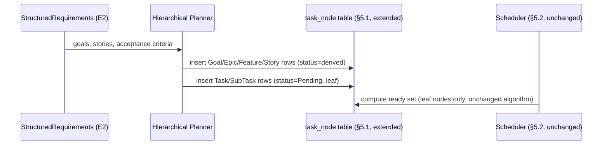

### Class Diagram

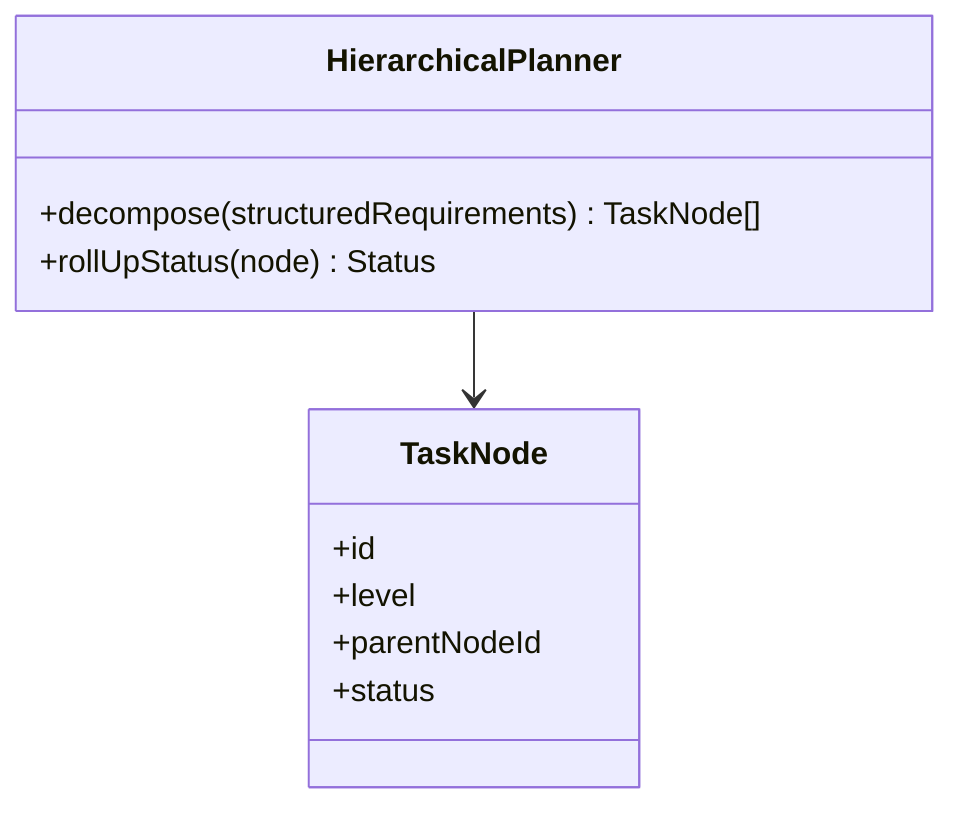

### Folder Structure Updates
```
ai-runtime/agents/planner/hierarchical_decomposition.py
api/Domain/Workflow/TaskNode.cs   # add Level, ParentNodeId properties
```

### Risk Analysis
| Risk | Mitigation |
|---|---|
| Deep hierarchies inflate rollup-computation cost | Rollup computed incrementally on child status change (same trigger pattern as §5.2's ready-set recompute), not full-tree recompute |

### Scalability Considerations
Rollup is O(depth) per status change, bounded by the fixed 6-level hierarchy
— no unbounded recursion risk.

---

## E4. Execution Graph

### Purpose
Generalize the DAG (§5) into a heterogeneous **Execution Graph** whose nodes
can be Agents, Tasks, Artifacts, Memory, Events, Tools, Approvals, or
Repositories — reusing the Knowledge Graph tables already defined in §13.2
rather than introducing a new graph store.

### Responsibilities
Represent and query relationships beyond task-ordering: ownership, reads,
writes, produces, consumes, requires — the full provenance graph of a
project.

### Architecture
§13.2 already defines `graph_nodes(type: Feature|Class|Module|Agent|Task|
Requirement)` and `graph_edges(relation: implements|depends_on|owns|
produced_by|tests)`. E4 extends both enums additively:

- New `graph_nodes.type` values: `Artifact`, `Memory`, `Event`, `Tool`,
  `Approval`, `Repository`.
- New `graph_edges.relation` values: `reads`, `writes`, `produces`,
  `consumes`, `requires`, `ownership`.

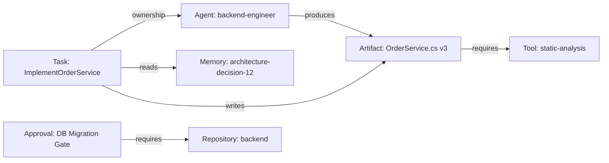

Existing §13.2 queries ("what implements requirement X") keep working
unchanged; new queries ("what does this artifact require", "which tasks read
this memory item") become possible with the same recursive-CTE pattern
already documented.

### Data Model Changes
Enum extensions only, on the exact tables §13.2 already defines. No new
tables.

### API Changes
`GET /api/graph?workspaceId=&nodeTypes=&relations=` — generalized graph
query endpoint (the existing knowledge-graph-specific queries from §13.2
become a filtered case of this same endpoint).

### Events
`GraphNodeAdded`, `GraphEdgeAdded` — fired whenever any existing event
(§6.3) implies a new provenance relationship (e.g., `TaskCompleted` with a
produced artifact auto-inserts a `produces` edge).

### Database Changes
`ALTER TYPE` (or check-constraint update, depending on final enum
implementation choice in §13.2) to add the new node/relation values.
Backward compatible — old rows unaffected.

### Frontend Changes
Extend the React Flow viewer (already in the stack per the original
diagram) with node-type-specific icons/colors and a filter panel (show/hide
Artifacts, Memory, Tools, etc.) layered on top of the existing DAG view —
same component, additional render modes.

### Interaction with Existing Components
Populated automatically by a small event-consumer that listens to the
existing event catalog (§6.3) and existing artifact/memory writes (§13.1,
§14.1) — no agent needs to change to "participate" in the graph.

### Deployment Impact
None beyond the graph-populating consumer, which runs inside the existing
`api` service as one more MediatR event handler.

### Migration Impact
Purely additive enum values; a backfill job can (optionally) walk existing
`workflow_events`/`artifacts` history to populate historical edges, but this
is not required for new data to work correctly.

### Sequence Diagram

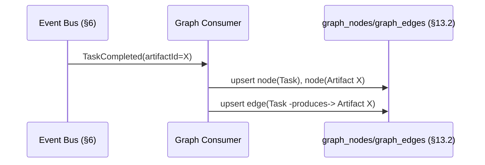

### Class Diagram

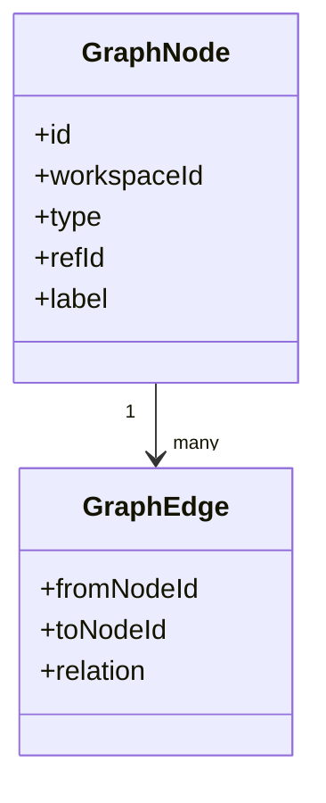

### Folder Structure Updates
```
api/Application/Graph/EventHandlers/PopulateGraphOnTaskCompleted.cs
frontend/components/execution-graph/GraphView.tsx
```

### Risk Analysis
| Risk | Mitigation |
|---|---|
| Graph grows unbounded on long-lived workspaces | Existing artifact/memory retention policies (E5 expiration) cascade to graph node pruning |

### Scalability Considerations
Same Postgres instance, recursive CTEs already proven at knowledge-graph
scale in §13.2 — revisit only if query latency becomes a measured problem
(same escalation note §13.2 already makes for a dedicated graph DB).

---

## E5. Multi-Layer Memory

### Purpose
Make explicit the five memory layers that §12 (Context Management) and
§13.1 (Vector Memory) already implied, without introducing a second storage
system — all five layers live in the same `memory_items` table (§13.1),
differentiated by a new `layer` column.

### Responsibilities
Working Memory (current execution context), Conversation Memory (messages),
Workflow Memory (current project execution), Project Memory (architecture,
decisions, artifacts), Long-Term Memory (user preferences, previous
projects) — plus, spanning all layers: semantic retrieval, compression,
summarization, scoring, expiration, versioning.

### Architecture

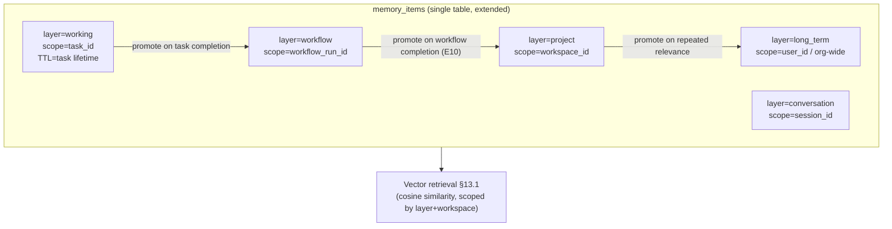

Promotion is a deliberate, event-driven step (not automatic for every item)
— only items the Learning Engine (E10) or an agent explicitly marks as
durable get promoted upward, which is what keeps Working/Conversation memory
from flooding Project/Long-Term memory.

### Data Model Changes
`memory_items` (§13.1) gains: `layer enum(working|conversation|workflow|
project|long_term) default 'workflow'`, `scope_ref uuid` (task/session/
workflow_run/workspace/user id depending on layer), `score float default 0`
(relevance/recency score, updated on each retrieval hit), `ttl_at timestamp
nullable` (expiration for working/conversation layers), `version int default
1`, `superseded_by_id uuid nullable` (memory versioning). All additive with
safe defaults — existing rows become `layer='workflow'` implicitly valid.

### API Changes
- `POST /api/memory/promote` `{ memoryItemId, targetLayer }`.
- `GET /api/memory/query?workspaceId=&layer=&kind=&k=` — layer-scoped
  retrieval (extends the existing retrieval path in §13.1/§20.1's RAG query).

### Events
`MemoryWritten`, `MemoryPromoted`, `MemoryExpired`, `MemorySummarized`.

### Database Changes
Five additive columns + index on `(workspace_id, layer, scope_ref)` for fast
scoped retrieval. No breaking change to the `kind` column already used for
RAG (§20.1) and Knowledge Base (§13.1) — `layer` and `kind` are orthogonal
dimensions.

### Frontend Changes
"Memory Inspector" panel (E11 Observability) showing item counts and
top-scored items per layer, per workspace.

### Interaction with Existing Components
- §12's sliding window / compression logic now explicitly operates on the
  `working`/`conversation` layers; its output (a `ContextSummary` artifact)
  is written back as a `project`-layer memory item with `kind='decision'` or
  similar — no change to §12's described mechanism, just a clearer home for
  its output.
- §13.1's RAG retrieval path (§20.1) becomes a `layer IN
  ('project','long_term')`-filtered query — existing callers that don't pass
  a layer filter get the same unscoped behavior as before (backward
  compatible default).

### Deployment Impact
None — same Postgres/pgvector instance.

### Migration Impact
Additive columns with defaults; existing `memory_items` rows are valid
`workflow`-layer entries without any data migration required.

### Sequence Diagram

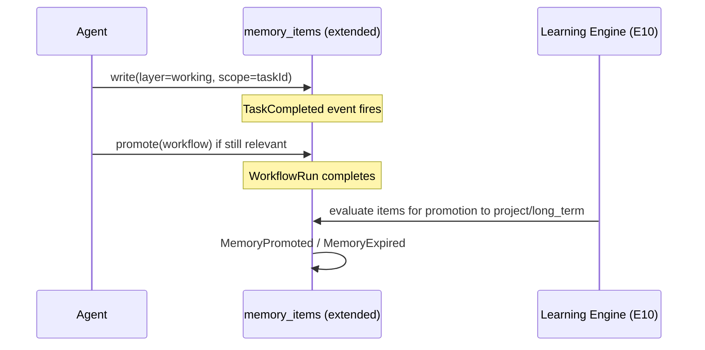

### Class Diagram

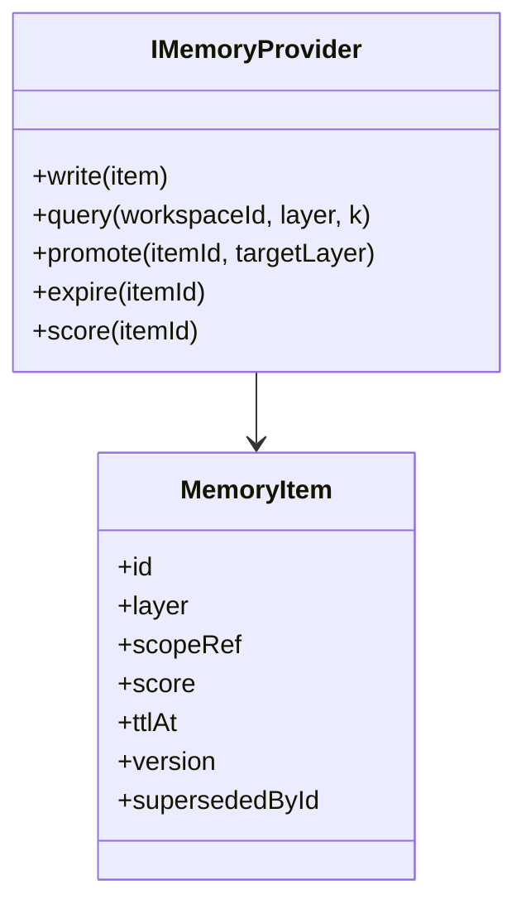

### Folder Structure Updates
```
ai-runtime/memory/
  layers.py          # layer enum + promotion rules
  scoring.py
  expiration.py
```

### Risk Analysis
| Risk | Mitigation |
|---|---|
| Working-layer items never expire, bloating the table | Default TTL enforced at write time for `working`/`conversation`; a scheduled cleanup job (existing checkpoint/cron pattern) deletes expired rows |
| Promotion logic promotes too aggressively, polluting Long-Term memory | Promotion to `long_term` requires an explicit Learning Engine (E10) score threshold, not agent discretion alone |

### Scalability Considerations
Layer + scope index keeps queries narrow even as `memory_items` grows;
partitioning by `workspace_id` is a natural future step if a single
workspace's memory volume becomes large (same pattern as any multi-tenant
Postgres table).

---

## E6. Reasoning Engine

### Purpose
Standardize every agent invocation through one pipeline, superseding §11.2's
five-stage Reflection Loop with a twelve-stage superset — the original five
stages (Plan, Execute, Critique, Improve, Final Answer) are preserved
verbatim as a subset of the new sequence, so any agent already built against
§11.2 needs no changes to remain correct.

### Responsibilities
Observe → Understand → Think → Plan → Retrieve Memory → Select Tools →
Execute → Reflect → Self-Critique → Improve → Confidence Score → Publish
Event.

### Architecture

```mermaid
flowchart LR
    Observe --> Understand --> Think --> Plan
    Plan --> RetrieveMemory["Retrieve Memory (E5)"]
    RetrieveMemory --> SelectTools["Select Tools (§8)"]
    SelectTools --> Execute
    Execute --> Reflect --> SelfCritique["Self-Critique"]
    SelfCritique --> Improve
    Improve --> Confidence["Confidence Score (§11.1)"]
    Confidence --> Publish["Publish Event (§6)"]
```

Mapping to §11.2's original stages: `Plan` = original `Plan`; `Execute` =
original `Execute`; `Reflect`+`SelfCritique` = original `Critique`;
`Improve` = original `Improve`; `Publish Event` replaces the implicit
"Final Answer" with an explicit event publish, consistent with §6's
"agents communicate only through events" principle. `Observe`, `Understand`,
`RetrieveMemory`, and `SelectTools` are new stages inserted *before* the
original loop begins.

### Data Model Changes
`reasoning_traces(id, task_id, agent, stage, input jsonb, output jsonb,
duration_ms, created_at)` — one row per stage per invocation, for full
step-level observability (feeds E11).

### API Changes
`GET /api/reasoning/traces/{taskId}` — stage-by-stage trace for the
frontend's Reasoning Steps viewer (E11).

### Events
`ReasoningStageCompleted` (per stage, high-volume — routed to a
lower-retention Redis stream than the main `workflow-events` stream, or
sampled, to avoid drowning out coarser-grained events).

### Database Changes
One new table, high write volume — indexed on `(task_id, stage)`; candidate
for time-based partitioning if retention grows large (see Scalability).

### Frontend Changes
"Reasoning Steps" viewer — expandable per-task drill-down showing all 12
stages with inputs/outputs, embedded in the existing DAG node detail panel.

### Interaction with Existing Components
Every agent's Execution Engine wrapper (§2 diagram, "Orc") now runs this
pipeline instead of directly implementing §11.2 — this is an internal
implementation upgrade of the same component the original diagram already
names, not a new component. §11.1's confidence/risk payload and §11.3's
debate trigger are unchanged; they're just now the pipeline's `Confidence
Score` stage output, feeding the same downstream consumers.

### Deployment Impact
None — same `ai-runtime` process; increased write volume to Postgres
(mitigated per Scalability below).

### Migration Impact
No breaking change: agents that only ever implemented the original 5 stages
continue to work because those stages are unchanged in meaning and order
within the new 12-stage sequence.

### Sequence Diagram

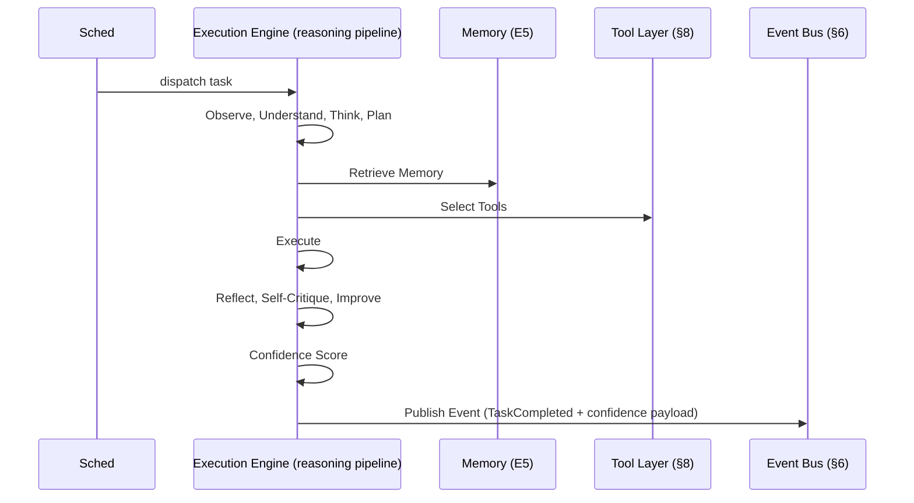

### Class Diagram

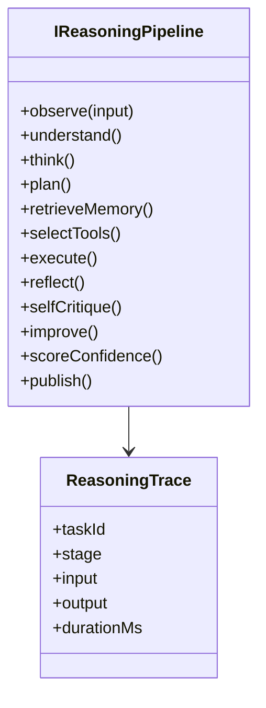

### Folder Structure Updates
```
ai-runtime/reasoning/
  pipeline.py          # the 12-stage orchestrator, base class for all agents
  stages/
    observe.py understand.py think.py plan.py
    retrieve_memory.py select_tools.py execute.py
    reflect.py self_critique.py improve.py confidence.py publish.py
```

### Risk Analysis
| Risk | Mitigation |
|---|---|
| Per-stage tracing adds latency to every agent call | Async, fire-and-forget writes to `reasoning_traces`; never block the pipeline stage itself |
| High write volume | Sampled tracing (configurable %) for high-frequency low-risk task types; full tracing always on for gated/high-risk tasks |

### Scalability Considerations
Time-partition `reasoning_traces` by month; archive/drop partitions past a
configurable retention window — same pattern as `workflow_events` archival
already described in §15.1.

---

## E7. Multi-Model Router

### Purpose
Deepen §20.2's provider abstraction (`complete(messages, tools, model_ref)`)
with an explicit routing decision layer that picks `model_ref`
automatically, rather than requiring it to be statically configured per
agent.

### Responsibilities
Choose the best model per invocation based on task type, latency budget,
cost budget, required accuracy, workspace policy, and agent type; support
automatic fallback across providers (OpenAI, Claude, Gemini, Ollama — §20.2's
existing adapter set, unchanged).

### Architecture

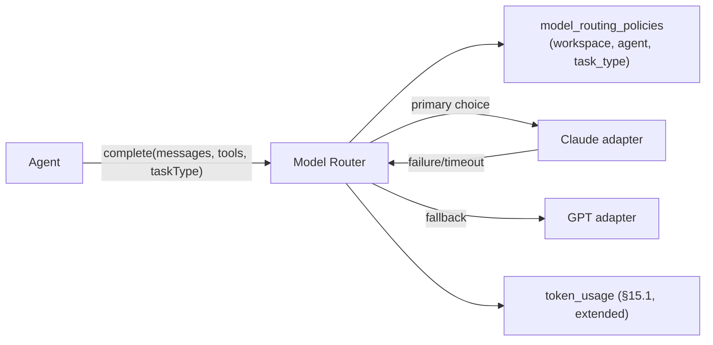

Router logic sits *inside* the existing `complete()` interface call path
(§20.2) — callers (agents) still call one function; they don't need to know
routing happened.

### Data Model Changes
`model_routing_policies(id, workspace_id, agent_capability, task_type,
preferred_model, fallback_models text[], max_cost_per_call, max_latency_ms)`.
`token_usage` (§15.1) gains: `model_used`, `fallback_triggered boolean`,
`routing_reason text`.

### API Changes
`GET/PUT /api/governance/model-routing-policies` (ties into E12 Governance
for who can change routing policy).

### Events
`ModelSelected`, `ModelFallbackTriggered`.

### Database Changes
One new table + three additive columns on `token_usage`. No change to
existing cost/latency reporting queries (§15.3) beyond optionally
breaking down by `model_used`, which they can already group by since it's
just a new column.

### Frontend Changes
Observability dashboard (E11) gets a "Model Usage & Fallback Rate" panel.

### Interaction with Existing Components
§20.2's adapters (OpenAI/Claude/Gemini/Ollama) are called *by* the router,
unchanged in their own contract. Agent manifests (§4.1) don't need a
`model` field to keep working — if no policy exists for an
agent/task-type, the router falls back to whatever static default §20.2
already specified for that agent, preserving current behavior exactly.

### Deployment Impact
None — logic lives inside the existing `ai-runtime` service.

### Migration Impact
Fully backward compatible: absence of a `model_routing_policies` row means
"use the existing static per-agent model config," i.e., today's behavior.

### Sequence Diagram

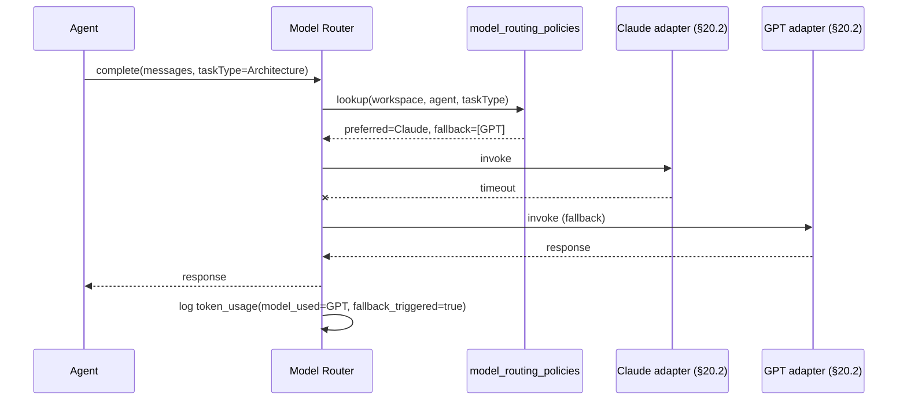

### Class Diagram

```mermaid
classDiagram
    class IModelRouter {
        +route(taskType, agentCapability, workspacePolicy) ModelChoice
        +invoke(choice, messages, tools) Response
    }
    class ModelRoutingPolicy {
        +agentCapability
        +taskType
        +preferredModel
        +fallbackModels
        +maxCostPerCall
        +maxLatencyMs
    }
    IModelRouter --> ModelRoutingPolicy
```

### Folder Structure Updates
```
ai-runtime/routing/
  model_router.py
  policies.py
```

### Risk Analysis
| Risk | Mitigation |
|---|---|
| Fallback cascades hide a systemic provider outage behind per-call retries | `ModelFallbackTriggered` rate monitored (E11); alert threshold (E12 budget/policy) escalates to human rather than silently degrading indefinitely |

### Scalability Considerations
Routing decision is a cheap in-memory policy lookup (cached from Postgres,
same pattern as Registry manifests §4) — negligible overhead per call.

---

## E8. Agent Collaboration Protocol

### Purpose
Give agents a structured communication vocabulary beyond raw event
publish/subscribe (§6) — Ask, Reply, Delegate, Broadcast, Debate, Vote,
Consensus, Escalate, Reject, Request Review, Transfer Ownership — all still
transported over the same Event Bus, just with a standardized message shape.

### Responsibilities
Standardize inter-agent messages so any agent (including third-party
plugins, §7/E13) can participate in negotiation, delegation, and review
without bespoke point-to-point integration.

### Architecture

```mermaid
flowchart LR
    A1["Agent A"] -- "Ask" --> Bus[("Event Bus §6")]
    Bus -- "Reply" --> A1
    A1 -- "Delegate" --> A2["Agent B"]
    A1 -- "Broadcast" --> Bus
    Bus --> A3["Agent C"]
    Bus --> A4["Agent D"]
    A2 -- "Escalate" --> Sup["Supervisor (E1)"]
    A1 -- "RequestReview" --> Rev["Reviewer Agent"]
    Rev -- "Vote / Consensus" --> Decision["agent_messages (thread)"]
```

### Data Model Changes
`agent_messages(id, thread_id, from_agent, to_agent_or_broadcast, type:
Ask|Reply|Delegate|Broadcast|Debate|Vote|Consensus|Escalate|Reject|
RequestReview|TransferOwnership, payload jsonb, in_reply_to_id, created_at)`
— a queryable conversation log distinct from the raw archived event stream
(§15.1), purpose-built for reconstructing a negotiation thread.

### API Changes
`GET /api/agent-messages/{threadId}` — full thread reconstruction for the
frontend (E11's "Agent Collaboration" panel).

### Events
Each protocol message type is *also* published as a standard event (§6.2
envelope, `type` = the protocol verb) — `agent_messages` is a queryable
projection of these events, same relationship `workflow_events` archive has
to the live Redis stream (§15.1).

### Database Changes
One new table, indexed on `thread_id` and `(from_agent, to_agent_or_
broadcast)`.

### Frontend Changes
"Agent Collaboration" panel — renders threads as a chat-like transcript,
reusing the same visual pattern as the Approval Gate / Clarification UI
(§9.1/E2) for consistency.

### Interaction with Existing Components
§11.3 Debate Mode is now expressed exactly as: `RequestReview` →
two `Debate` messages (one per candidate result) → `Vote`/`Consensus` from
the Reviewer agent. §11.3's described behavior (scheduler inserts
`DebateA`/`DebateB`/`ReviewerDecision` task nodes) is unchanged — those task
nodes now communicate using this protocol instead of ad hoc payloads, which
is a formalization, not a behavior change.

### Deployment Impact
None — protocol is a schema/convention over the existing Event Bus.

### Migration Impact
Additive table; existing event-only communication continues to work for
agents that don't yet use the structured protocol verbs.

### Sequence Diagram

```mermaid
sequenceDiagram
    participant Backend as backend-engineer
    participant Reviewer
    participant Bus as Event Bus

    Backend->>Bus: RequestReview(threadId=T1, artifactId=X)
    Bus->>Reviewer: consume
    Reviewer->>Bus: Ask(threadId=T1, question="confirm migration safety?")
    Bus->>Backend: consume
    Backend->>Bus: Reply(threadId=T1, answer=...)
    Reviewer->>Bus: Vote(threadId=T1, decision=approve)
    Bus->>Bus: agent_messages projection updated
```

### Class Diagram

```mermaid
classDiagram
    class AgentMessage {
        +threadId
        +fromAgent
        +toAgentOrBroadcast
        +type
        +payload
        +inReplyToId
    }
    class ICollaborationProtocol {
        +ask(thread, question)
        +reply(thread, answer)
        +delegate(task, toAgent)
        +broadcast(message)
        +requestReview(artifact)
        +vote(thread, decision)
        +escalate(thread, toSupervisor)
    }
    ICollaborationProtocol --> AgentMessage
```

### Folder Structure Updates
```
ai-runtime/collaboration/
  protocol.py
  verbs/ ask.py reply.py delegate.py broadcast.py debate.py vote.py
         consensus.py escalate.py reject.py request_review.py transfer_ownership.py
```

### Risk Analysis
| Risk | Mitigation |
|---|---|
| Unbounded Ask/Reply loops between two agents | Thread depth limit; beyond threshold, auto-`Escalate` to Supervisor (E1) |

### Scalability Considerations
Message volume scales with active agent count, not workflow size — bounded
and small relative to the main event stream.

---

## E9. Workflow Template Library

### Purpose
Let common project shapes (CRUD API, AI Chatbot, Enterprise SaaS, Dashboard,
Portfolio, Marketplace, Microservices, Mobile App, RAG System, ML Pipeline)
generate a starting DAG instantly, instead of the Architect/Planner agents
building every workflow from zero.

### Responsibilities
Store reusable DAG blueprints; instantiate them into a concrete
`WorkflowRun` given `StructuredRequirements` (E2) and hierarchy refinement
(E3).

### Architecture

```mermaid
flowchart LR
    Classify["ProjectClassified (E2)"] --> Lib["Workflow Template Library"]
    Lib -- "matching template" --> Blueprint["DAG Blueprint (JSON)"]
    Blueprint --> Instantiate["Instantiate"]
    Instantiate --> Nodes["TaskNode/TaskEdge rows (§5.1)"]
    Instantiate --> Hierarchy["Hierarchical Planner (E3) refines further"]
```

### Data Model Changes
`workflow_templates(id, name, category, dag_blueprint jsonb,
parameters_schema jsonb, version, created_at)`. `WorkflowDefinition` (§5.1)
gains: `source_template_id uuid nullable` — tracks which template (if any)
generated this run, purely informational.

### API Changes
`GET /api/workflow-templates?category=`, `POST
/api/workflow-templates/{id}/instantiate { workspaceId, parameters }` →
returns a new `WorkflowRun` seeded from the blueprint.

### Events
`TemplateInstantiated`.

### Database Changes
One new table + one additive nullable column on `WorkflowDefinition`.

### Frontend Changes
Template gallery page (cards per category) as an alternative entry point to
the Intake flow (E2) — "start from scratch" vs. "start from template," both
converging on the same `WorkflowRun` creation path.

### Interaction with Existing Components
Instantiation calls the exact same `POST /api/workflows/runs` path (§23)
that any programmatic caller already uses — templates are a convenience
generator in front of an unchanged creation API.

### Deployment Impact
None.

### Migration Impact
Additive; existing ad hoc/generated (non-template) workflows are simply
rows with `source_template_id = NULL`.

### Sequence Diagram

```mermaid
sequenceDiagram
    actor Human
    participant Gallery as Template Gallery (frontend)
    participant API as Workflow API (§23)
    participant Sched as Scheduler (§5.2)

    Human->>Gallery: select "RAG System" template
    Gallery->>API: POST /workflow-templates/{id}/instantiate
    API->>API: expand dag_blueprint into TaskNode/TaskEdge rows
    API-->>Gallery: new WorkflowRun id
    Sched->>Sched: begin scheduling (unchanged §5.2 flow)
```

### Class Diagram

```mermaid
classDiagram
    class WorkflowTemplate {
        +id
        +name
        +category
        +dagBlueprint
        +parametersSchema
        +version
    }
    class TemplateInstantiator {
        +instantiate(template, parameters) WorkflowRun
    }
    TemplateInstantiator --> WorkflowTemplate
```

### Folder Structure Updates
```
api/Application/Templates/
  Commands/InstantiateTemplateCommand.cs
templates/
  crud-api.json ai-chatbot.json enterprise-saas.json dashboard.json
  portfolio.json marketplace.json microservices.json mobile-app.json
  rag-system.json ml-pipeline.json
```

### Risk Analysis
| Risk | Mitigation |
|---|---|
| Blueprint drift from evolving best practices | Templates are versioned; E10 Learning Engine can propose new template versions from successful workflow patterns |

### Scalability Considerations
Templates are read-mostly, small JSON blobs — trivially cacheable.

---

## E10. Learning Engine

### Purpose
Turn every completed workflow into durable improvement: better prompts,
better routing, better planning, better memory — closing the loop that §14.2
(Prompt Versioning) and §15 (Execution History) already made *possible* but
didn't automate.

### Responsibilities
Extract lessons; improve prompts; update confidence baselines; improve
planning heuristics; improve model routing policies (E7); improve memory
promotion decisions (E5); track failures and successful patterns; produce
reusable best practices.

### Architecture

```mermaid
flowchart TB
    Trigger["WorkflowRun reaches\nterminal state (§9.2 checkpoint)"] --> Learn["Learning Engine"]
    Learn --> Traces["reasoning_traces (E6)"]
    Learn --> Usage["token_usage (§15.1)"]
    Learn --> Approvals["approval outcomes (§9.1)"]
    Learn --> Reviews["CodeReviewApproved/Rejected (§6.3)"]
    Learn --> Lessons["lessons_learned"]
    Learn --> Scores["agent_scores"]
    Learn --> PromptOpt["prompt_optimization_runs"]
    Lessons --> Memory["memory_items (E5, kind=lesson_learned,\nlayer=long_term)"]
    Scores --> Router["Model Router policies (E7)"]
    Scores --> Registry["Agent Registry priority (§4)"]
    PromptOpt --> PromptTemplates["prompt_templates (§14.2, new version)"]
```

### Responsibilities detail
Note `lessons_learned` writing into `memory_items` reuses the **exact**
`kind='lesson_learned'` value §13.1's schema already reserved — this is the
concrete mechanism the original architecture anticipated but didn't wire up.

### Data Model Changes
- `lessons_learned(id, workspace_id, workflow_run_id, category, insight,
  evidence_refs jsonb, created_at)`
- `agent_scores(agent_name, task_type, success_rate, avg_confidence,
  avg_cost, avg_latency_ms, last_updated)`
- `prompt_optimization_runs(id, prompt_template_id, from_version, to_version,
  rationale, ab_test_result jsonb, created_at)`

### API Changes
`GET /api/learning/lessons?workspaceId=`, `GET
/api/learning/agent-scores?agentName=`, `GET
/api/learning/prompt-optimizations/{templateId}`.

### Events
`LessonExtracted`, `AgentScoreUpdated`, `PromptOptimized`.

### Database Changes
Three new additive tables. `agent_scores` is upserted (one row per
agent/task-type), the other two are append-only logs.

### Frontend Changes
"Learning Progress" panel (E11): agent score trends over time, recent
lessons feed, prompt optimization history with A/B results.

### Interaction with Existing Components
- Reads `reasoning_traces` (E6), `token_usage` (§15.1), approval outcomes
  (§9.1), review events (§6.3) — all pre-existing or E-series data sources,
  no new instrumentation required elsewhere.
- Writes new versions to `prompt_templates` (§14.2) using that table's
  existing `version`/`superseded_by` mechanism — no schema change to §14.2.
- Feeds E7's `model_routing_policies` and can suggest (not silently
  override) §4's agent `priority` field via a human-reviewable proposal,
  respecting §8's permission model (Learning Engine itself has no direct
  write permission to production agent config — see E12 Governance).

### Deployment Impact
Runs as a triggered job (on workflow terminal state) inside `ai-runtime`,
not a standing service — no new container.

### Migration Impact
Fully additive; the system functions without the Learning Engine exactly as
§1–§25 describe, just without automatic improvement over time.

### Sequence Diagram

```mermaid
sequenceDiagram
    participant Sched as Scheduler
    participant CP as Checkpoint (§9.2)
    participant Learn as Learning Engine
    participant Prompt as prompt_templates (§14.2)
    participant Mem as memory_items (E5)

    Sched->>CP: WorkflowRun -> Completed (final checkpoint)
    CP->>Learn: ImprovementLoopStarted (E14)
    Learn->>Learn: analyze traces, usage, approvals, reviews
    Learn->>Mem: write lessons_learned (kind=lesson_learned, layer=long_term)
    Learn->>Prompt: propose new prompt_template version
    Learn->>Learn: update agent_scores
    Learn->>CP: ImprovementLoopCompleted (E14)
```

### Class Diagram

```mermaid
classDiagram
    class ILearningEngine {
        +analyzeCompletedRun(workflowRunId)
        +extractLessons() Lesson[]
        +updateAgentScores()
        +proposePromptOptimization(templateId) OptimizationProposal
    }
    class AgentScore {
        +agentName
        +taskType
        +successRate
        +avgConfidence
    }
    ILearningEngine --> AgentScore
```

### Folder Structure Updates
```
ai-runtime/learning/
  analyzer.py
  lesson_extractor.py
  prompt_optimizer.py
  agent_scorer.py
```

### Risk Analysis
| Risk | Mitigation |
|---|---|
| Automated prompt changes regress quality silently | New prompt versions are proposals (E12 Governance approval required) before becoming the active version, never auto-promoted without review for high-risk agents |
| Small sample sizes produce noisy agent_scores | Minimum sample-size threshold before a score influences routing/priority |

### Scalability Considerations
Runs once per completed workflow — volume scales linearly with workflow
throughput, not with workflow complexity; safe to run as an async background
job without blocking workflow completion itself.

---

## E11. Observability 2.0

### Purpose
Expand §15.3's dashboard with panels for every capability this document
adds, without introducing new backend infrastructure — every new panel
reads data already produced by E1–E10 and existing §15.1 execution history.

### Responsibilities
Show: Execution Graph (E4) live view, Live DAG (§5, already shown), Agent
Status (§4 registry), Memory Usage (E5), Context Usage (§12/E5), Model Usage
(E7), Costs (§15.1, extended), Latency (§15.1), Retries (§10), Failures
(§10), Approval Gates (§9.1), Timeline (§15.1), Artifacts (§14.1), Learning
Progress (E10), Reasoning Steps (E6).

### Architecture

```mermaid
flowchart TB
    subgraph Sources["Existing + E-series data (all already persisted)"]
        WFEvents["workflow_events §15.1"]
        Tokens["token_usage §15.1/E7"]
        Traces["reasoning_traces E6"]
        Scores["agent_scores E10"]
        Mem["memory_items E5"]
        Graph["graph_nodes/edges E4"]
    end
    Sources --> Views["Materialized views /\non-demand aggregation"]
    Views --> API["/api/observability/* (§23, extended)"]
    API --> Dash["Next.js Observability Dashboard"]
```

### Data Model Changes
None required beyond what E1–E10 already define — this section is purely
new read models (views) and new frontend pages.

### API Changes
Extends the existing `GET /api/observability/dashboard` (§23) with query
parameters selecting which new panel's data to include, plus dedicated
endpoints where a panel needs its own pagination: `/api/observability/
reasoning-steps`, `/api/observability/learning-progress`,
`/api/observability/memory-usage`.

### Events
None new — this is a read-side capability.

### Database Changes
Optional materialized views for expensive aggregations (e.g., agent
utilization trend), refreshed on the same schedule §15.3 already proposes.

### Frontend Changes
New dashboard tabs: Execution Graph, Reasoning, Learning, Memory — added to
the existing observability page (§15.3) as additional routes/tabs, not a
new app.

### Interaction with Existing Components
Strictly additive read layer. Every existing §15.3 panel continues to query
exactly as documented.

### Deployment Impact
None.

### Migration Impact
None — no schema changes of its own.

### Sequence Diagram

```mermaid
sequenceDiagram
    actor User
    participant Dash as Dashboard
    participant API as Observability API
    participant PG as Postgres (views over E1-E10 tables)

    User->>Dash: open "Reasoning Steps" tab
    Dash->>API: GET /observability/reasoning-steps?taskId=
    API->>PG: query reasoning_traces
    PG-->>API: rows
    API-->>Dash: render stage timeline
```

### Class Diagram

```mermaid
classDiagram
    class ObservabilityQueryService {
        +getExecutionGraph(workflowRunId)
        +getReasoningSteps(taskId)
        +getLearningProgress(workspaceId)
        +getMemoryUsage(workspaceId)
    }
```

### Folder Structure Updates
```
frontend/app/observability/
  execution-graph/page.tsx
  reasoning/page.tsx
  learning/page.tsx
  memory/page.tsx
```

### Risk Analysis
| Risk | Mitigation |
|---|---|
| Dashboard queries over high-volume tables (reasoning_traces) slow down | Materialized views + pagination; time-range required on all new panel queries |

### Scalability Considerations
Read-only, cacheable, horizontally scalable behind the existing stateless
`api` service (§21).

---

## E12. AI Governance

### Purpose
Consolidate policy enforcement that today is implicit or scattered (§8
permission strings, §14.2 prompt versions, §20.2 static model config) into
an explicit, queryable governance layer, without changing how §8's
enforcement point actually checks permissions.

### Responsibilities
Prompt versioning policy, model policies, tool policies, permission
policies, human approval policies, workspace policies, security policies,
budget policies.

### Architecture

```mermaid
flowchart LR
    Policies["governance_policies\n(prompt|model|tool|permission|approval|workspace|security|budget)"]
    Budget["budget_policies"]
    Consumers["Consumers:\nModel Router (E7), Supervisor (E1),\nTool Layer (§8), Scheduler approval gates (§9.1)"]
    Policies --> Consumers
    Budget --> Consumers
    Consumers -- "violation" --> Events["PolicyViolationDetected /\nBudgetThresholdReached"]
```

### Data Model Changes
- `governance_policies(id, workspace_id, policy_type: prompt|model|tool|
  permission|approval|workspace|security|budget, rules jsonb, enforced_by,
  created_at)`
- `budget_policies(workspace_id, max_cost_per_run, max_cost_per_day,
  alert_thresholds jsonb)`

### API Changes
`GET/PUT /api/governance/policies?workspaceId=&type=`,
`GET /api/governance/budget?workspaceId=`.

### Events
`PolicyViolationDetected`, `BudgetThresholdReached`.

### Database Changes
Two new additive tables.

### Frontend Changes
"Governance" settings page per workspace — policy editor grouped by type,
budget thresholds with live spend (from `token_usage`, §15.1/E7).

### Interaction with Existing Components
This layer is *consulted*, not enforcing on its own: §8's Tool Calling
Layer already checks `agent.permissions` against `tool.requiresPermission`
— E12 adds an additional, prior check against `governance_policies` of
`policy_type='tool'`/`'permission'` for workspace-level overrides (e.g., a
workspace-wide ban on a tool regardless of individual agent permissions).
§9.1's Approval Gate defaults (Architecture/Deployment/Major
Refactoring/Database Migration) become the seed data for
`policy_type='approval'` rows — configurable per workspace instead of
hardcoded, but defaulting to exactly what §9.1 already specifies.

### Deployment Impact
None.

### Migration Impact
Seed `governance_policies` with rows reproducing §9.1's and §8's current
hardcoded defaults, so enabling governance changes nothing until a workspace
admin actively edits a policy.

### Sequence Diagram

```mermaid
sequenceDiagram
    participant Agent
    participant ToolLayer as Tool Calling Layer (§8)
    participant Gov as governance_policies
    participant Bus as Event Bus

    Agent->>ToolLayer: request tool "terminal"
    ToolLayer->>Gov: check policy_type=tool for workspace
    Gov-->>ToolLayer: allowed / denied
    ToolLayer->>ToolLayer: check agent.permissions (§8, unchanged)
    alt denied by either check
        ToolLayer->>Bus: PolicyViolationDetected
    end
```

### Class Diagram

```mermaid
classDiagram
    class GovernancePolicy {
        +policyType
        +rules
        +enforcedBy
    }
    class IGovernanceChecker {
        +check(workspaceId, policyType, context) Decision
    }
    IGovernanceChecker --> GovernancePolicy
```

### Folder Structure Updates
```
api/Application/Governance/
  Policies/GovernancePolicy.cs
  Queries/CheckPolicyQuery.cs
```

### Risk Analysis
| Risk | Mitigation |
|---|---|
| Policy layer becomes a bypassable second gate if inconsistently checked | Governance check wired into the single existing enforcement point (§8's Tool Calling Layer) rather than duplicated per-agent |

### Scalability Considerations
Policies are cached per workspace (same pattern as Registry manifests, §4)
— check is an in-memory lookup, not a per-call DB hit.

---

## E13. Agent Marketplace

### Purpose
Broaden §7's Plugin System and §8's Tool Marketplace into a full catalog
covering every pluggable type — agents, tools, workflow templates (E9),
prompt packs, memory providers, model providers — publishable by external
developers without core changes. §8's "Tool Marketplace" remains valid as
the tool-specific subset of this broader catalog.

### Responsibilities
Publishing, discovery, versioning, and installation of external packages
into a workspace, using §7's existing discovery mechanisms (entry-points,
manifest registration) as the installation backend.

### Architecture

```mermaid
flowchart LR
    Dev["External developer"] -- "publish" --> Listings["marketplace_listings"]
    Workspace -- "browse/install" --> Listings
    Listings -- "install" --> Installed["installed_packages"]
    Installed -- "agent/tool manifest" --> Registry["Agent Registry §4 /\nTool Marketplace §8"]
    Installed -- "workflow template" --> Templates["workflow_templates E9"]
    Installed -- "memory/model provider" --> Providers["IMemoryProvider §7 /\nmodel adapters §20.2"]
```

### Data Model Changes
- `marketplace_listings(id, type: agent|tool|workflow_template|prompt_pack|
  memory_provider|model_provider, name, publisher, version, manifest_ref,
  install_count, rating, created_at)`
- `installed_packages(workspace_id, listing_id, version, installed_at,
  status: active|disabled)`

### API Changes
`GET /api/marketplace/listings?type=&search=`,
`POST /api/marketplace/listings/{id}/install { workspaceId }`,
`POST /api/marketplace/listings/{id}/publish` (developer-facing).

### Events
`PackagePublished`, `PackageInstalled`.

### Database Changes
Two new additive tables.

### Frontend Changes
Marketplace browse/search page; per-workspace "Installed Packages"
management page.

### Interaction with Existing Components
Installing an `agent` or `tool` listing does nothing more than perform the
exact registration/manifest-loading flow §4/§7/§8 already define — the
marketplace is a discovery/UX layer in front of mechanisms that already
work without it (a developer can still register an agent directly per §4
without ever touching the marketplace).

### Deployment Impact
None for install/publish metadata. Installed agents/tools still run per
their own deployment needs (own container, or loaded into `ai-runtime` via
entry-points, per §7).

### Migration Impact
Additive; existing manually-registered agents/tools are simply not
represented as marketplace listings, which is fully valid.

### Sequence Diagram

```mermaid
sequenceDiagram
    actor Dev as External Developer
    participant Market as Marketplace API
    participant WS as Workspace
    participant Registry as Agent Registry (§4)

    Dev->>Market: POST /listings/publish (agent manifest + package ref)
    Market->>Market: PackagePublished
    WS->>Market: GET /listings?type=agent
    WS->>Market: POST /listings/{id}/install
    Market->>Registry: trigger existing §4 registration flow
    Registry-->>Market: AgentRegistered (§6.3, unchanged)
```

### Class Diagram

```mermaid
classDiagram
    class MarketplaceListing {
        +type
        +name
        +publisher
        +version
        +manifestRef
        +rating
    }
    class InstalledPackage {
        +workspaceId
        +listingId
        +status
    }
    MarketplaceListing "1" --> "many" InstalledPackage
```

### Folder Structure Updates
```
api/Application/Marketplace/
  Commands/PublishListingCommand.cs
  Commands/InstallListingCommand.cs
```

### Risk Analysis
| Risk | Mitigation |
|---|---|
| Malicious third-party agent/tool package | Installation requires the same permission bounds check as §4.2's manifest validation (a plugin's requested permissions must be a subset of what the workspace allows) — marketplace doesn't bypass that gate |

### Scalability Considerations
Listing catalog is read-heavy, cacheable; install/publish are low-frequency
writes.

---

## E14. Autonomous Improvement Loop

### Purpose
Chain Execution Review → Metrics Analysis → Failure Analysis → Lessons
Learned → Prompt Optimization → Memory Update → Planning Improvements →
Agent Score Update → Knowledge Base Update into one automatic sequence after
every workflow, expressed as an ordinary `WorkflowDefinition` (§5.1) —
dogfooding the existing DAG engine rather than building a second
orchestration mechanism.

### Responsibilities
Own the ordering/dependency of the E10 Learning Engine's sub-capabilities so
they run as a coherent, observable process rather than disconnected jobs.

### Architecture

```mermaid
flowchart TD
    Trigger["WorkflowRun -> Completed/Failed\n(§9.2 checkpoint)"] --> IL["ImprovementLoop WorkflowRun\n(new WorkflowDefinition, §5.1)"]
    IL --> Review["ExecutionReview task"]
    Review --> Metrics["MetricsAnalysis task"]
    Metrics --> Failure["FailureAnalysis task"]
    Failure --> Lessons["LessonsLearned task (E10)"]
    Lessons --> PromptOpt["PromptOptimization task (E10)"]
    PromptOpt --> MemUpdate["MemoryUpdate task (E5)"]
    MemUpdate --> Planning["PlanningImprovements task (E3 heuristics)"]
    Planning --> ScoreUpdate["AgentScoreUpdate task (E10)"]
    ScoreUpdate --> KBUpdate["KnowledgeBaseUpdate task (§13.1)"]
```

Because this is a real `WorkflowRun`, it gets everything for free: DAG
scheduling (§5.2), retries (§10), confidence scoring (§11.1), and full
observability (E11) — no bespoke pipeline code.

### Data Model Changes
None new — reuses `WorkflowDefinition`/`WorkflowRun`/`TaskNode` (§5.1). One
seed row in `workflow_templates` (E9): a system-owned "improvement-loop"
template, auto-instantiated (not user-selected) on every workflow
completion.

### API Changes
None new — instantiation happens automatically via the same instantiation
path E9 defines, triggered internally rather than by human/gallery action.

### Events
`ImprovementLoopStarted`, `ImprovementLoopCompleted` (wrapping the run's
normal `TaskCreated`/`TaskCompleted` events, §6.3).

### Database Changes
None beyond the one seed template row.

### Frontend Changes
Improvement Loop runs are visible in the existing DAG viewer like any other
`WorkflowRun` — optionally filtered into their own "System" category in the
workflow list so they're not confused with user-facing project workflows.

### Interaction with Existing Components
Every task in this DAG is executed by an E10 Learning Engine capability
registered as an agent per §4 — e.g., `lessons-learned-agent`,
`prompt-optimizer-agent`. This section is purely about *sequencing*
E10/E5/E3's capabilities using §5's existing engine.

### Deployment Impact
None.

### Migration Impact
Purely additive; disabling the improvement-loop template means workflows
complete exactly as §9.2 describes today, with no automatic learning step.

### Sequence Diagram

```mermaid
sequenceDiagram
    participant CP as Checkpoint (§9.2)
    participant API as Workflow API
    participant Sched as Scheduler (§5.2)

    CP->>API: WorkflowRun Completed
    API->>API: instantiate "improvement-loop" template (E9)
    API->>Sched: new WorkflowRun (ImprovementLoop)
    Sched->>Sched: schedule Review->Metrics->Failure->Lessons->...->KBUpdate
    Note over Sched: identical mechanics to any user workflow
```

### Class Diagram

```mermaid
classDiagram
    class ImprovementLoopTemplate {
        +tasks: ExecutionReview, MetricsAnalysis, FailureAnalysis,
                LessonsLearned, PromptOptimization, MemoryUpdate,
                PlanningImprovements, AgentScoreUpdate, KnowledgeBaseUpdate
    }
```

### Folder Structure Updates
```
templates/system/improvement-loop.json
ai-runtime/agents/learning/
  execution_review_agent.py
  metrics_analysis_agent.py
  failure_analysis_agent.py
```

### Risk Analysis
| Risk | Mitigation |
|---|---|
| Improvement loop runs consume compute/cost on every workflow, including trivial ones | Governance budget policy (E12) can cap or skip the loop below a workflow-size threshold |

### Scalability Considerations
One extra `WorkflowRun` per completed project workflow — linear, bounded
overhead, scheduled exactly like any other workflow.

---

## E15. Project Health Intelligence

### Purpose
Expand §18's Project Health Score formula with the additional factors this
spec requires, as a superset of the existing weighted average — the
existing seven factors (architecture, security, performance, testing,
maintainability, documentation, scalability) keep their exact meaning and
data sources.

### Responsibilities
Add: Technical Debt, Test Coverage (made explicit as its own factor,
previously folded into "testing"), AI Confidence, Prompt Quality, Memory
Quality, Workflow Efficiency, Cost Efficiency, and a rolled-up Overall
Engineering Score.

### Architecture

```mermaid
flowchart TB
    Existing["§18 existing 7 factors\n(unchanged weights/sources)"] --> New["Extended formula"]
    TechDebt["Technical Debt\n(from ArchitectureValidator §17 findings trend)"] --> New
    AIConf["AI Confidence\n(agent_scores E10 avg_confidence)"] --> New
    PromptQ["Prompt Quality\n(prompt_optimization_runs E10 A/B results)"] --> New
    MemQ["Memory Quality\n(memory_items E5 score distribution)"] --> New
    WFEff["Workflow Efficiency\n(§15.1 latency/retry rates)"] --> New
    CostEff["Cost Efficiency\n(token_usage §15.1/E7 vs. budget E12)"] --> New
    New --> Overall["Overall Engineering Score"]
```

### Data Model Changes
`project_health_snapshots` (§18) gains additive nullable columns:
`technical_debt_score`, `ai_confidence_score`, `prompt_quality_score`,
`memory_quality_score`, `workflow_efficiency_score`,
`cost_efficiency_score`, `overall_engineering_score`. Existing columns
(architecture/security/performance/testing/maintainability/documentation/
scalability) and their weights are unchanged.

### API Changes
`GET /api/health-score/{workspaceId}` (§23, existing route) response
extended with the new fields — additive JSON, existing consumers reading
only the original fields are unaffected.

### Events
`HealthScoreComputed`.

### Database Changes
Seven additive nullable columns on an existing table — no migration risk to
historical snapshots (they simply lack the new scores until recomputed).

### Frontend Changes
Health Score page (§18's existing dashboard panel) gets new radar-chart
axes for the additional factors, and the new "Overall Engineering Score"
headline number.

### Interaction with Existing Components
Directly extends §18's computation job — same trigger (nightly / on
demand), same `project_health_snapshots` table, same consumers. New factors
pull from E10 (`agent_scores`, `prompt_optimization_runs`), E5
(`memory_items.score`), and existing §15.1 (`token_usage`,
`workflow_events`).

### Deployment Impact
None.

### Migration Impact
Additive columns; the score computation job is updated to populate them
going forward, historical snapshots remain valid with nulls for pre-upgrade
rows.

### Sequence Diagram

```mermaid
sequenceDiagram
    participant Job as Health Score Job (§18, extended)
    participant Val as ArchitectureValidator (§17)
    participant Learn as agent_scores/prompt_optimization_runs (E10)
    participant Mem as memory_items (E5)
    participant Snap as project_health_snapshots

    Job->>Val: existing 7-factor inputs (unchanged)
    Job->>Learn: AI confidence, prompt quality
    Job->>Mem: memory quality
    Job->>Job: compute new factors + overall score
    Job->>Snap: insert extended snapshot row
```

### Class Diagram

```mermaid
classDiagram
    class ProjectHealthSnapshot {
        +architectureScore
        +securityScore
        +performanceScore
        +testingScore
        +maintainabilityScore
        +documentationScore
        +scalabilityScore
        +technicalDebtScore
        +aiConfidenceScore
        +promptQualityScore
        +memoryQualityScore
        +workflowEfficiencyScore
        +costEfficiencyScore
        +overallEngineeringScore
    }
```

### Folder Structure Updates
```
api/Application/HealthScore/ComputeHealthScoreJob.cs   # extended, not replaced
```

### Risk Analysis
| Risk | Mitigation |
|---|---|
| New factors double-count signal already in existing factors (e.g., Test Coverage vs. "testing") | Document explicit source separation: existing "testing" factor = pass/fail ratio (§18 original); new "Test Coverage" = line/branch coverage percentage — distinct metrics, not duplicative once defined precisely |

### Scalability Considerations
Same nightly/on-demand batch computation pattern as §18 — no new
scalability profile.

---

## E16. Future Distributed Execution

### Purpose
Document why §21's existing deployment topology (`api` and `ai-runtime` both
stateless, all shared state in Postgres/Redis) already supports scaling
toward remote agents, cloud workers, multiple AI Runtime clusters,
distributed DAG scheduling, and cross-region execution — and what specific,
additive changes would be needed when that scale is actually required. No
component is redesigned now.

### Responsibilities
Provide a forward-compatible path, not an implementation, for:
Remote Agents, Cloud Workers, Multi-cluster AI Runtime, Distributed DAG
Scheduling, Cross-region execution.

### Architecture

```mermaid
flowchart TB
    subgraph Today["Today (§21, unchanged)"]
        API1["api (stateless)"]
        AR1["ai-runtime (stateless)"]
        PG[("Postgres")]
        Redis[("Redis Streams")]
    end
    subgraph Future["Future — additive only"]
        RemoteAgent["Remote agent\n(any host, registers via §4 HTTP protocol\nalready network-agnostic)"]
        Cluster2["ai-runtime cluster (region B)"]
        RedisCluster[("Redis Cluster /\nfederated event bus")]
        Leader["Distributed lock / leader election\nper WorkflowRun"]
    end
    API1 --> PG
    AR1 --> Redis
    RemoteAgent -.->|"already works: §4.2\nregistration is just HTTP"| API1
    Cluster2 -.->|"needs: region tag on manifest,\nfederated bus"| RedisCluster
    API1 -.->|"needs: partition WorkflowRuns\nby workspace_id with leader election"| Leader
```

### Why no redesign is needed
- **Remote Agents** already work today: §4.2's registration protocol is a
  plain HTTP `POST` with an `endpoint` field — an agent process on any
  reachable host can register right now. Nothing to build.
- **Cloud Workers**: `ai-runtime` is already stateless per §21 — running
  additional replicas (in another cluster/region) is a deployment change,
  not a code change, *as long as* they all point at the same Redis/Postgres
  (or a federated equivalent — see below).
- **Distributed DAG Scheduling**: §5.2's scheduler recomputes the ready set
  reactively per `WorkflowRun`. Running multiple scheduler instances safely
  requires per-`WorkflowRun` leader election (e.g., a Redis-based
  distributed lock keyed by `workflowRunId`) so exactly one instance
  advances a given run's state — additive infrastructure, no change to the
  ready-set algorithm itself.
- **Cross-region**: requires (a) a `region` field added to the agent
  manifest (§4.1) so the scheduler can prefer same-region agents for
  latency-sensitive tasks, falling back cross-region — additive optional
  field; (b) Redis Streams becoming a Redis Cluster or a federated bus if
  cross-region event delivery latency/availability becomes a bottleneck —
  swap behind the existing Event Bus interface (§6.1 already frames Redis
  as an implementation choice behind an interface).

### Data Model Changes (future, not now)
`agents` (§4) gains optional `region` column. No changes required today.

### API Changes (future, not now)
None required now; `endpoint`-based registration (§4.2) already supports
remote hosts.

### Events
None new required now.

### Database Changes
None now.

### Frontend Changes
None now; a future "Region" filter on the Agent Status panel (E11) once
`region` exists.

### Interaction with Existing Components
Purely a forward-compatibility note against §4 (registration), §5.2
(scheduler), §6.1 (Event Bus interface), and §21 (deployment topology) — no
change to any of them today.

### Deployment Impact
None now. Future: additional `ai-runtime` deployment groups per region,
Redis Cluster migration when needed.

### Migration Impact
None now — this section is documentation of a scaling path, deliberately
deferred until real cross-region load justifies the added operational
complexity (consistent with §21's existing "revisit only if proven
necessary" stance on Redis Streams itself).

### Sequence Diagram

```mermaid
sequenceDiagram
    participant RemoteAgent as Remote Agent (region B)
    participant API as Registry API (§4.2, unchanged)
    participant Sched as Scheduler
    participant Lock as Distributed Lock (future)

    RemoteAgent->>API: POST /registry/agents (endpoint=https://region-b/agent)
    API-->>RemoteAgent: AgentRegistered (§6.3, unchanged)
    Sched->>Lock: acquire lock(workflowRunId) [future]
    Lock-->>Sched: granted
    Sched->>RemoteAgent: dispatch task (unchanged §5.2 dispatch)
```

### Class Diagram

```mermaid
classDiagram
    class AgentManifest {
        +name
        +endpoint
        +region  ~future~
    }
```

### Folder Structure Updates
No changes required now; future work isolated to deployment configs
(`docker-compose.region-b.yml`) rather than application code.

### Risk Analysis
| Risk | Mitigation |
|---|---|
| Premature distributed-systems complexity (leader election, federated bus) before it's needed | Explicitly deferred — this section is a documented path, not a build item, matching §21's own "add later only if proven necessary" pattern |

### Scalability Considerations
This entire section *is* the scalability consideration — the payoff of
§21's original stateless design choice is that this list of "future"
capabilities requires no redesign, only additive configuration and optional
fields when the need materializes.

---

## Summary: what stays exactly as documented in ARCHITECTURE.md

Every original section (§1–§25) — the two-runtime split, Agent Registry,
DAG Scheduler algorithm, Event Bus envelope and transport, Plugin System,
Tool Marketplace, Permission enforcement point, Approval Gates, Checkpoints,
Self-Healing retry logic, Confidence Scoring/Reflection/Debate mechanics,
Context Management, Vector Memory and Knowledge Graph tables, Artifact
versioning, Prompt Versioning table, Execution History/Replay,
Observability dashboard, Sandbox execution, Diff Engine, PR generation, the
seven analyzer/advisor agents, the original Project Health Score formula,
Multi-Workspace/Multi-Repository model, RAG ingestion, multi-provider model
abstraction, and the Docker Compose topology — is unmodified. `E1`–`E16`
add a supervisory reasoning layer, a pre-workflow intake phase, hierarchy,
a richer graph, layered memory, a standardized reasoning pipeline, model
routing, structured agent communication, reusable templates, automated
learning, deeper observability, formal governance, a marketplace, an
automated improvement loop, a deeper health score, and a documented (not
yet built) distributed-execution path — entirely as additive layers,
tables, columns, and events on top of the existing design.
