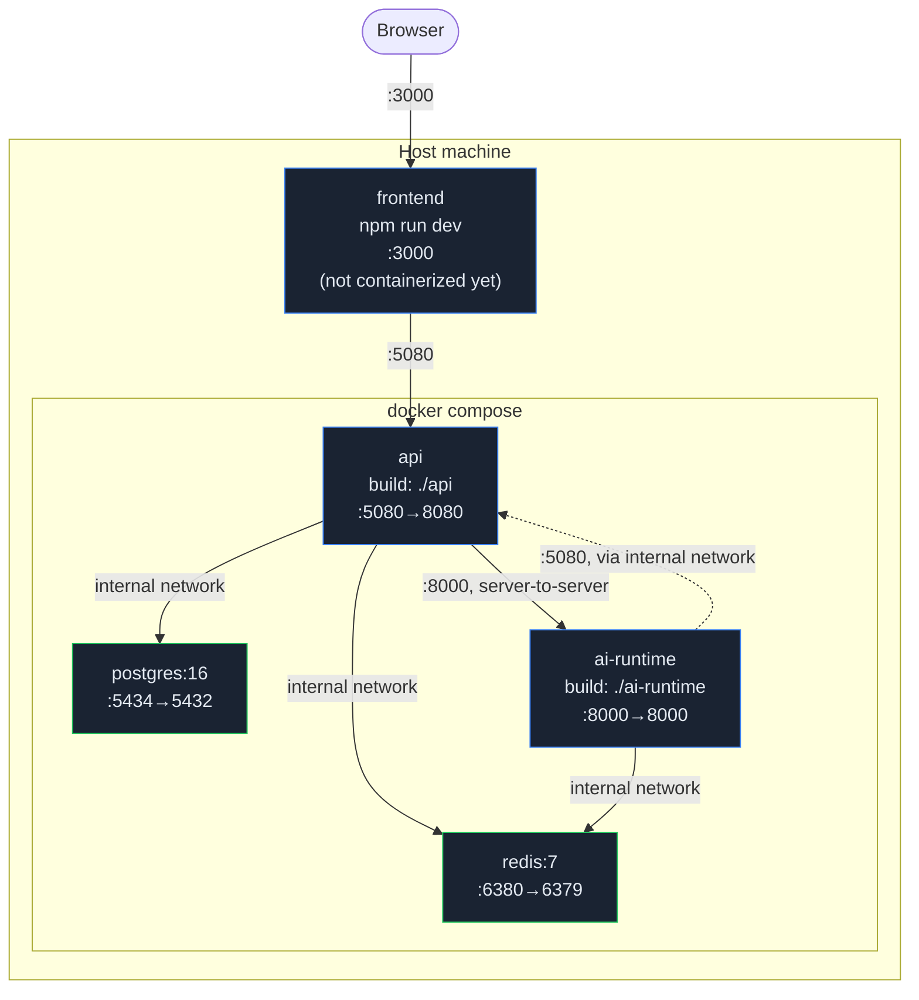

# Deployment

## Local (the supported path today)

```bash
git clone https://github.com/Ali-Khamis45/Multi-Agent-orkflow-.git
cd Multi-Agent-orkflow-
docker compose up -d          # postgres, redis, api, ai-runtime
cd frontend
cp .env.example .env.local
npm install
npm run dev                   # http://localhost:3000
```

No API keys are required — see [Reasoning Engine](architecture/REASONING_ENGINE.md#model-routing)
for why. This is the only deployment topology this project currently packages, tests, and demos.

## Container topology



The frontend is **not yet containerized** — `docker-compose.yml` has a placeholder comment noting
it's deliberately left out until its Dockerfile lands, specifically so `docker compose up` always
succeeds at every commit without waiting on frontend build stability. Run it with `npm run dev` (or
`npm run build && npm start` for a production Next.js build) alongside the compose stack.

## Configuration

All configuration flows through environment variables — nothing is hardcoded in application code
(this was an explicit Phase 1.5 requirement, the "Configuration Layer"). `docker-compose.yml` sets
container-to-container values directly; `.env.example` files document the equivalent for running a
service outside Docker.

| Variable | Service | Default (docker-compose) | Purpose |
|---|---|---|---|
| `ConnectionStrings__Postgres` | api | `Host=postgres;...;Password=aiagentsteam` | Database connection |
| `ConnectionStrings__Redis` | api | `redis:6379` | Event bus connection |
| `Cors__AllowedOrigins__0` | api | `http://localhost:3000` | Allowed dashboard origin(s) — see [Security Review](reviews/SECURITY_REVIEW.md) |
| `AiRuntime__BaseUrl` | api | `http://ai-runtime:8000` | Where the API proxies `/api/intake` and `/api/prompts` to |
| `API_BASE_URL` | ai-runtime | `http://api:8080` | Where the AI runtime calls back into |
| `REDIS_URL` | ai-runtime | `redis://redis:6379` | Event bus connection |
| `WORKSPACE_FILES_ROOT` | ai-runtime | `/data/workspace-files` (volume-backed) | Filesystem tool sandbox root |
| `ANTHROPIC_API_KEY` / `OPENAI_API_KEY` / `GEMINI_API_KEY` / `OLLAMA_HOST` | ai-runtime | unset | Optional — enables real model calls; unset runs entirely on the deterministic mock |
| `NEXT_PUBLIC_API_BASE_URL` | frontend | `http://localhost:5080` | The only backend host the dashboard talks to |
| `NEXT_PUBLIC_SIGNALR_URL` | frontend | `http://localhost:5080/hubs/workflow` | Live-update channel |

**Do not reuse the default Postgres password (`aiagentsteam`) anywhere but local development** —
see [Security Review §2](reviews/SECURITY_REVIEW.md#2-secrets-management). It exists purely so a
fresh clone works with zero setup.

## Before deploying anywhere beyond localhost

This project's current scope is a local/demo deployment, and the security posture reflects that
honestly (see the [Security Review](reviews/SECURITY_REVIEW.md) in full). At minimum, before
putting this behind a public URL:

1. **Add authentication** — there is none today, anywhere (API, SignalR hub, or frontend).
2. **Do not publish Postgres or Redis ports** — `docker-compose.yml`'s `5434`/`6380` host mappings
   exist for local debugging convenience only; a production compose/deployment should drop them and
   let the API/AI-runtime reach them only over the internal Docker network.
3. **Put the API and AI runtime behind a reverse proxy** with TLS termination; the AI runtime in
   particular should not be reachable from outside the Docker network at all — the frontend never
   calls it directly (verified in the [Code Review](reviews/CODE_REVIEW.md)).
4. **Rotate the Postgres credentials** and inject them via a secrets manager, not `appsettings.json`.
5. **Add non-root `USER` directives** to both `api/Dockerfile` and `ai-runtime/Dockerfile`.
6. **Set real model provider keys** if you want actual LLM output rather than the deterministic mock.

## Health checks

- Postgres and Redis both have `docker-compose.yml` healthchecks (`pg_isready`, `redis-cli ping`)
  gating dependent service startup — `api` waits on both being healthy, `ai-runtime` waits on `api`
  and `redis`.
- No `/health` endpoint currently exists on the API or AI runtime beyond basic process liveness —
  worth adding before any orchestrator (Kubernetes, ECS, etc.) needs a real readiness probe.
