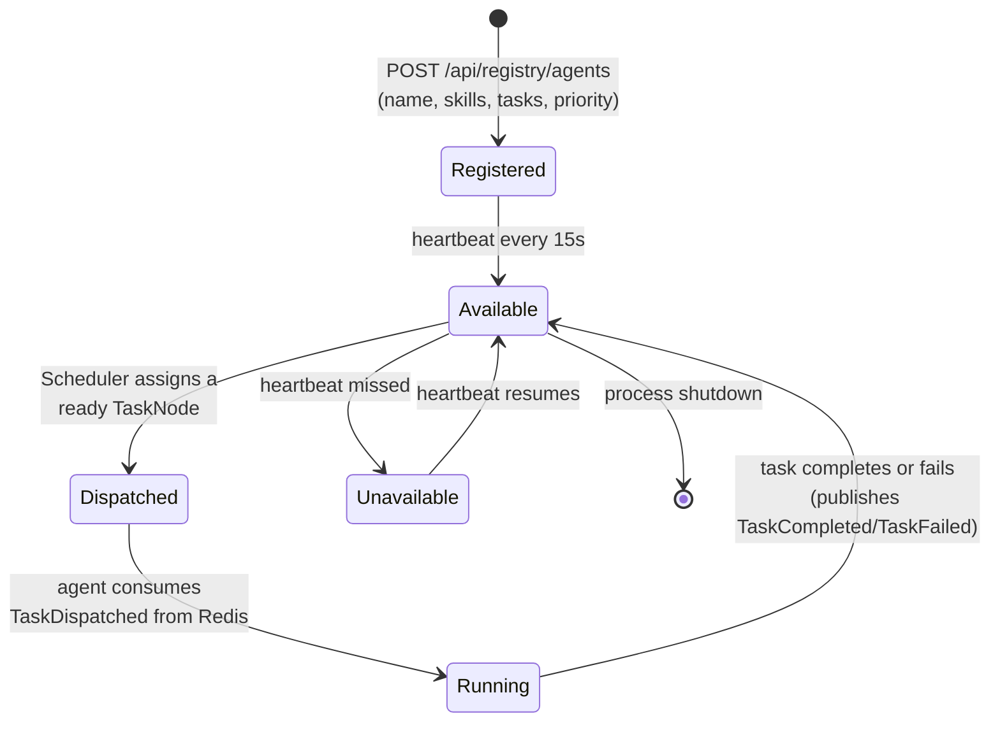

# Agent Lifecycle

## The 7 agents

All 7 are declarative subclasses of `AgentBase` (`ai-runtime/app/agents/base.py`) — each is
~20 lines defining a name, skills, supported task types, and a priority, plus one
`execute_domain_logic` method. None reimplement registration, heartbeat, retry, telemetry, or
persistence — that's all inherited and identical across agents (see
[Code Review](../reviews/CODE_REVIEW.md)).

| Agent | Skills | Handles |
|---|---|---|
| **business-analyst** | requirements-analysis, user-stories | Requirement discovery, gap analysis, acceptance criteria |
| **project-manager** | planning, prioritization | Task planning, backlog, sprint/priority sequencing |
| **system-architect** | architecture, clean-architecture, ddd | Component/data-model/API design, tech-stack decisions |
| **backend-engineer** | dotnet, backend, cqrs | Backend feature implementation per Clean Architecture + CQRS |
| **frontend-engineer** | nextjs, react, frontend | Frontend feature implementation |
| **code-reviewer** | code-review, static-analysis | Correctness, architecture conformance, approve/reject |
| **qa-engineer** | testing, qa | Test planning, test cases, pass/fail assessment |

(Two additional lightweight `echo-agent`/`echo-agent-2` registrations exist in the demo dataset from
integration testing — not part of the production agent set.)

## Lifecycle

## Registration & heartbeat

Every agent process registers itself with the API on startup
(`POST /api/registry/agents` — see [API Reference](../API.md)) and sends a heartbeat on a
`HEARTBEAT_INTERVAL_SECONDS` cadence (default 15s). The registry's `Status` field
(`Available`/`Busy`/`Unavailable`) and `LastHeartbeatAt` are what the Agents page's status badges
and filters read directly — an agent that stops heartbeating shows as `Unavailable` without any
special-case logic on the dashboard side.

## Dispatch → execute → publish

1. `SchedulerService` (`.NET API`, see [Workflow Engine](WORKFLOW_ENGINE.md)) marks a `TaskNode`
   `Ready` once all its predecessors are `Completed`, then `Dispatched`, and publishes a
   `TaskDispatched` event to Redis.
2. `AgentEventConsumer` (`ai-runtime/app/orchestration/event_consumer.py`), subscribed to the
   `ai-runtime-agents` consumer group, receives the event and routes it to the matching agent's
   `handle_task_dispatched`.
3. The agent runs the full [12-stage reasoning pipeline](REASONING_ENGINE.md), producing an
   artifact (if applicable) and a `ReasoningTrace` row per stage.
4. On success, the agent calls back through `ApiClient` to mark the task `Completed` and publishes
   `TaskCompleted`; on failure, `Failed` and `TaskFailed`, carrying a `StructuredFailure`.

## Retries

A `StructuredFailure` marked `retryable` (see [Reasoning Engine](REASONING_ENGINE.md#failure-handling))
causes the Supervisor Brain to issue a `Retry` decision, which resets the task to `Ready` and
re-dispatches it, incrementing `AttemptCount`. Non-retryable failures propagate to a terminal
`Failed` state on both the task and — if unrecoverable — the workflow run. `TaskNode.AttemptCount`
and `RetryCount` on each `ReasoningTrace` are what the Agent Profile's "Avg Attempts" stat and the
Telemetry Center's "Retries by stage" chart read from.

## Where this surfaces in Mission Control

- **Agents page**: the live registry, filterable by status/role/skill.
- **Agent Profile**: current task (if any, derived from live task-node status), model usage,
  confidence trend, recent executions, and the cross-workflow reasoning timeline.
- **Dashboard**: "Agents available" count, Agent Fleet panel.
