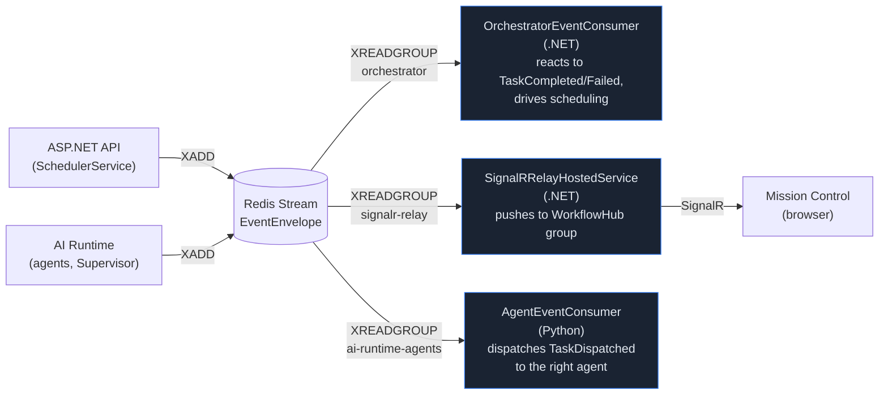

# Event Bus

Redis Streams (`XADD`/`XREADGROUP`), not a direct call, is what connects the .NET API and the AI
runtime for orchestration, and what pushes live updates to the dashboard. One stream, three
independent consumer groups.

## Event flow



Each group reads the **same events independently** — a slow or crashed consumer in one group never
blocks or delays another. This is why a browser tab reconnecting to SignalR after a network blip
never causes a missed scheduling decision: `signalr-relay` and `orchestrator` don't share progress
through the stream.

## `EventEnvelope`

Every event on the stream shares one shape (`app/models/event_envelope.py` on the Python side,
mirrored in `.NET`'s `Application.Common.Messaging.EventEnvelope`):

```json
{
  "type": "TaskCompleted",
  "workspaceId": "…",
  "workflowRunId": "…",
  "taskId": "…",
  "correlationId": "…",
  "producedBy": "backend-engineer",
  "timestamp": "2026-…",
  "confidence": 0.85,
  "riskLevel": null,
  "payloadJson": "{...type-specific fields...}"
}
```

`CorrelationId` threads a single logical operation (e.g. one intake submission and everything it
causes) across every event and every `ReasoningTrace`/`SupervisorDecision` row it produces — the
one place in this system where distributed-tracing-style correlation actually exists end to end.

**Serialization note** (also called out in [API Reference](../API.md) and the
[Performance Review](../reviews/PERFORMANCE_REVIEW.md)): `EventEnvelope` on the wire is PascalCase
(`System.Text.Json.JsonSerializer.Serialize` called directly, not through ASP.NET's MVC formatter),
unlike every HTTP API response, which is camelCase. The same is true of `Checkpoint.SnapshotJson`.
Anything reading directly off the Redis stream or a checkpoint's raw JSON needs to know this;
anything calling the REST API does not.

## Event types in active use

| Event | Published by | Consumed by |
|---|---|---|
| `TaskDispatched` | .NET Scheduler | AI runtime agents |
| `TaskCompleted` | AI runtime agent | .NET orchestrator (scheduling), SignalR relay |
| `TaskFailed` | AI runtime agent | .NET orchestrator (retry/replan), SignalR relay |
| `WorkflowRunCompleted` | .NET Scheduler | SignalR relay |

A larger set of event types (`AgentRegistered`, `AgentUnavailable`, `SupervisorReplanRequested`,
`ReasoningStageCompleted`, and others) is already defined in the shared constants on both sides but
has no current producer — reserved surface for later phases, flagged as such in the
[Code Review](../reviews/CODE_REVIEW.md) rather than left silently unexplained.

## Where this surfaces in Mission Control

The **Event Console** (bottom panel, always available) is a live, terminal-style feed of every
event the `signalr-relay` group has pushed — this is the one place in the UI that shows raw event
flow rather than a persisted-and-refetched view of state.
