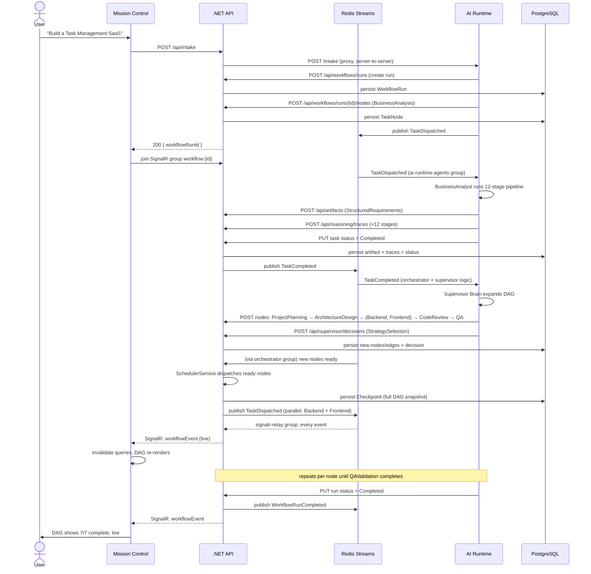
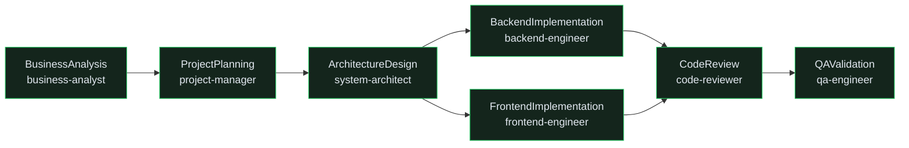

# Execution Flow

End-to-end path from a one-line goal to a completed workflow, as it actually runs — this is the
literal sequence behind the "Build a Task Management SaaS" demo.

## Sequence

## What each stage actually persists

| Step | Written by | Where | Read later by |
|---|---|---|---|
| Workflow run created | AI runtime, via API | `WorkflowRuns` | Dashboard, Workflow Runs list |
| Task node created | AI runtime, via API | `TaskNodes` | Execution Graph |
| Reasoning stage completed | AI runtime, via API | `ReasoningTraces` | Reasoning Inspector, Telemetry Center |
| Artifact produced | AI runtime, via API | `Artifacts` (versioned) | Artifacts Explorer |
| Supervisor decision | AI runtime, via API | `SupervisorDecisions` | Supervisor Brain page |
| Scheduling pass snapshot | .NET API scheduler | `Checkpoints` | Execution Playback |
| Live event | .NET API (Redis relay) | not persisted — SignalR push only | Event Console, live DAG |

Every row above except the last is durable and queryable after the fact — the live SignalR event is
the *notification* that something changed; the dashboard always re-fetches the real row rather than
trusting the event payload as a source of truth.

## The DAG

The task graph isn't fixed up front — it starts as a single node (`BusinessAnalysis`) and the
Supervisor Brain expands it as each stage completes, based on what it learns. For the canonical demo
goal, the DAG that results looks like this:

`BackendImplementation` and `FrontendImplementation` share a column because they're dispatched
**together** — both become "ready" the instant `ArchitectureDesign` completes, since neither depends
on the other. This is what Mission Control's Execution Graph is drawn from directly: the frontend's
`lib/dag-layout.ts` assigns each node a column equal to its longest-path distance from a root, so
parallel branches visually align without any server-side layout hint.

`CodeReview` is a **join node** — it depends on both parallel branches. Because a node's inputs are
fixed at creation time but its parallel predecessors haven't necessarily finished yet, `CodeReview`
references its inputs *by artifact name*, not by ID, and resolves the latest version of each by name
once it actually starts (`GetLatestArtifactByNameQuery` — see [API Reference](../API.md)).

## Playback

Because the scheduler writes a `Checkpoint` (a complete node/edge/status snapshot) after **every**
scheduling pass, Mission Control's Execution Playback isn't an animation interpolating between "now"
and "the end" — it's a scrubber over real historical states. See
[Workflow Engine](WORKFLOW_ENGINE.md#checkpoints--execution-playback) for how checkpoints are built.
