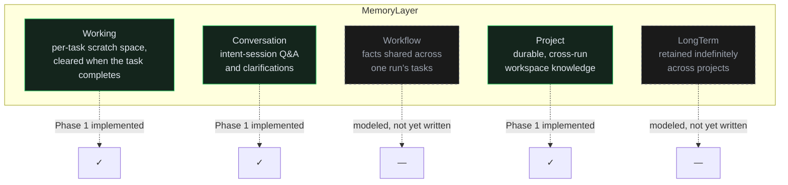

# Memory

A single-table, five-layer memory model (`MemoryItems` in Postgres, owned entirely by the .NET API
— the AI runtime only ever reads/writes it through HTTP, via `ai-runtime/app/memory/memory_client.py`).

## The five layers

Phase 1 writes to **Working**, **Conversation**, and **Project**; **Workflow** and **LongTerm** are
fully modeled in the schema (so no migration is needed to activate them) but have no current writer
— see [Roadmap](../ROADMAP.md).

## Schema

Every `MemoryItem` carries:

| Field | Purpose |
|---|---|
| `WorkspaceId` | Which workspace this belongs to. |
| `Layer` | One of the five above. |
| `ScopeRef` | A GUID scoping the item — e.g. a `TaskNodeId` for Working memory, an `IntentSessionId` for Conversation. |
| `Kind` | `Requirement`, `Architecture`, `Code`, `Doc`, `Decision`, or `LessonLearned`. |
| `Content` | The actual text. |
| `SourceArtifactId` | Optional link back to the artifact this memory came from — this is the "Relationships" the Memory Inspector's "source artifact" link is built on. |
| `Score` | Reserved for embedding-similarity ranking — see below. |
| `Version` / `SupersededById` | Update history: a memory item can be superseded by a newer version rather than overwritten, so the Memory Inspector can show "v2, superseded" rather than silently losing the prior value. |
| `TtlAt` | Optional expiry, mainly relevant to Working memory. |

## Retrieval today vs. planned

Retrieval is currently **recency-ordered within (workspace, layer, scope)** —
`QueryMemoryQuery`/`GetMemoryOverviewQuery` order by `CreatedAt DESC`. The `Score` field exists
specifically so that embedding-similarity ranking (Vector Memory) can be added later as a *new
ordering strategy over the same schema*, not a redesign — this was a deliberate Phase 1 decision so
the retrieval interface wouldn't need to change shape when semantic search lands. See
[Roadmap](../ROADMAP.md).

## Where this surfaces in Mission Control

The **Memory Inspector** page shows: per-layer counts, a browsable feed across every scope (not
just one task), relationships to source artifacts, and version/supersession history. It also
displays two explicitly-labeled placeholder cards — **Knowledge Graph** and **Vector Memory** —
stating plainly that they're planned and not built, rather than rendering an empty or fabricated
panel.
