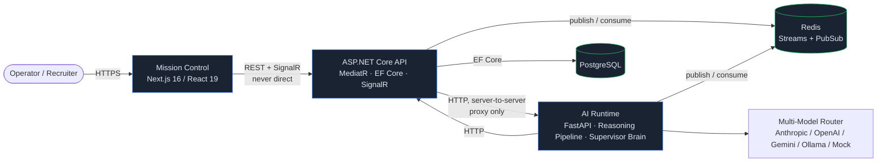
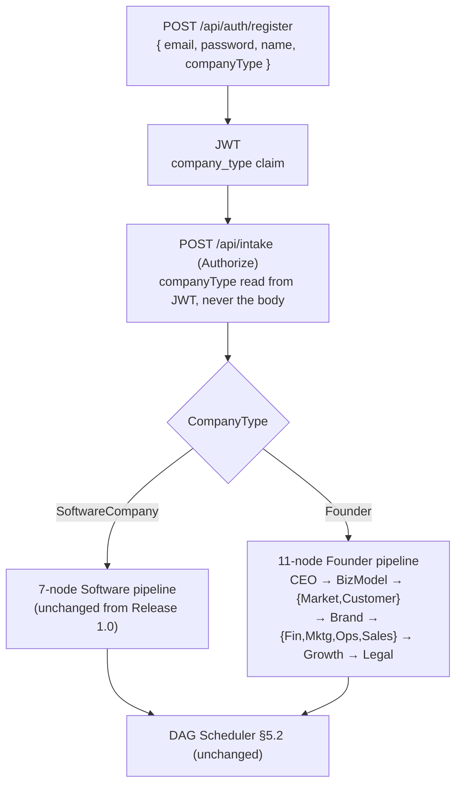
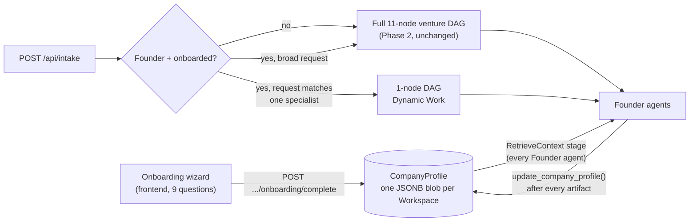
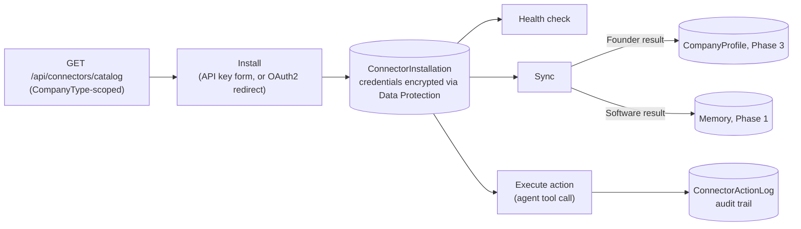

# Architecture Overview

## System design

AI Agents Team is three cooperating services plus two data stores, each with one clear
responsibility:

| Service | Responsibility | Never does |
|---|---|---|
| **`api/`** (.NET 10) | Owns all durable state. Orchestrates workflow runs, schedules tasks, exposes the only HTTP/SignalR surface the frontend talks to. | Reason about *what* to do — it schedules and persists, it doesn't plan. |
| **`ai-runtime/`** (Python) | The "brain." Intent analysis, the 12-stage reasoning pipeline, the Supervisor Brain's dynamic DAG expansion, the multi-model router, 7 specialist agents. | Touch a database. Every write goes through the .NET API's HTTP endpoints. |
| **`frontend/`** (Next.js) | Mission Control — renders everything the platform does, live. | Talk to `ai-runtime` directly. Every request goes through the .NET API; live updates arrive over its SignalR hub. |
| **PostgreSQL** | System of record: workflow runs, task graphs, artifacts, memory, telemetry, checkpoints. | — |
| **Redis** | Event bus (Streams) + pub/sub for live updates. Not a system of record — nothing is only in Redis. | — |

Two boundaries are load-bearing and enforced, not just conventions:

1. **The AI runtime never touches Postgres.** Verified in the [Code Review](../reviews/CODE_REVIEW.md) —
   no `asyncpg`/`sqlalchemy`/`psycopg` import exists anywhere in `ai-runtime/app`. Every persistence
   operation is an HTTP call to the .NET API via `app/clients/api_client.py`.
2. **The frontend never talks to the AI runtime.** Verified the same way — no reference to the AI
   runtime's port or host exists anywhere in `frontend/src`. Two endpoints exist purely to proxy this
   server-to-server: `POST /api/intake` and `GET /api/prompts`.

## Overall system diagram



## Why this shape

- **The API is the only writer to Postgres.** That means every durable fact about the system —
  what a task's status is, what an agent produced, what the Supervisor decided — has exactly one
  code path that can change it, which is what makes [Execution Playback](EXECUTION_FLOW.md#playback)
  possible: a `Checkpoint` row written after every scheduling pass is a complete, trustworthy
  snapshot, because nothing else could have mutated state out from under it.
- **Redis Streams, not a direct call, connects the API and the AI runtime for orchestration.** The
  API publishes `TaskDispatched`; the AI runtime's agents consume it, do the work, and publish
  `TaskCompleted`/`TaskFailed` back. Three independent consumer groups (`orchestrator`,
  `signalr-relay`, `ai-runtime-agents`) read the same stream, so a slow or crashed SignalR relay can
  never block scheduling, and a crashed agent process can never lose an event — see
  [Event Bus](EVENT_BUS.md).
- **The dashboard is a read/observe surface, not a second writer.** It calls the API for data and
  submits new work through `POST /api/intake`, but it never reaches into Postgres or Redis, and it
  never calls the AI runtime — every observable fact it renders (a DAG node's status, a reasoning
  trace, a supervisor decision) is a live projection of what the API layer already persisted.

## Folder structure

```
api/                              ASP.NET Core 10, Clean Architecture
  Domain/                         Entities, value objects, domain logic — zero dependencies
    Agents/ Artifacts/ Checkpoints/ Common/ Failures/ Intent/ Memory/ Reasoning/ Supervisor/ Users/ Workflow/ Workspaces/
                                   (Users/ holds User + CompanyType — Phase 2, see below)
  Application/                    CQRS (MediatR): one folder per feature, Commands/ + Queries/ inside
    Artifacts/ Checkpoints/ Intent/ Memory/ Observability/ Reasoning/ Registry/ Scheduling/ Supervisor/ Workflows/ Workspaces/
    Common/                       Shared interfaces (IApplicationDbContext, IEventBus, ...), pipeline behaviors
  Infrastructure/                 EF Core, Npgsql, Redis Streams, the AI-runtime HTTP client
  Api/                            Controllers, SignalR hubs, middleware, composition root (Program.cs)
  Tests/AiAgentsTeam.IntegrationTests/   Testcontainers-backed handler tests

ai-runtime/                       Python 3.12 / FastAPI, the system's "brain"
  app/
    agents/                       AgentBase + 7 Software agents + 11 founder-* agents (Phase 2)
    clients/                      ApiClient (HTTP to .NET), RedisEventBus
    intent/                       Intent classification/complexity/ambiguity heuristics
    memory/                       MemoryClient (writes through the API, never direct)
    models/                       Wire-format models (EventEnvelope, etc.)
    orchestration/                Event consumers that dispatch work to agents
    reasoning/                    The 12-stage ReasoningPipeline + StructuredFailure
    routing/                      ModelRouter (multi-provider + deterministic mock fallback)
    supervisor/                   SupervisorAgent — dynamic DAG expansion
    tools/                        ToolRegistry, sandboxed FilesystemTool, PromptLoaderTool, PromptRegistry
    prompts/                      Versioned prompt JSON files (the Prompt Registry's source of truth)
  tests/                          Fake-based unit tests (no live network/DB)
  scripts/benchmark.py            Standalone performance-baseline CLI

frontend/                         Next.js 16 (App Router), React 19, TypeScript — Mission Control
  src/
    app/                          Routes: one folder per page (dashboard is app/page.tsx)
                                   login/ register/ — Phase 2 auth pages
                                   founder/ — Phase 2 Founder Workspace (own layout + 14 pages)
    components/                   Feature-organized (agents/ artifacts/ auth/ dashboard/ founder/
                                   graph/ health/ layout/ memory/ prompts/ supervisor/ telemetry/
                                   workflows/), plus shared/ and ui/ (shadcn primitives)
    hooks/                        TanStack Query hooks — the only place components fetch data from
    lib/                          api-client.ts (the only network boundary — attaches the JWT),
                                   types.ts, pure helpers
    store/                        Zustand stores for client-only UI state, incl. auth-store.ts
                                   (JWT + current user, Phase 2) and workspace-store.ts

docs/                              Everything you're reading now
  architecture/                    This directory
  reviews/                         Code/Security/Performance review (Release 1.0)
  demo/                            Demo package (Release 1.0)
  screenshots/ video/              Mission Control tour assets
```

## Phase 2 — AI Enterprise OS (Workspaces)

Release 1.0 shipped one product: an autonomous AI software engineering company. Phase 2 turns the
same shared infrastructure into a platform with multiple **Workspaces** — a Workspace is a
specialized AI company (its own agents, its own fixed pipeline, its own frontend shell) built on
top of the infrastructure above, which stays exactly as documented in every section above it.
Nothing in §"System design" changed: still three services, still the same two enforced boundaries.

Two Workspaces exist today: **Software Company** (Release 1.0, unchanged) and **Founder Workspace**
(new — a business operating system for startup founders, with 11 specialist agents: CEO, Business
Analyst, Market/Customer Researcher, Brand Strategist, Financial Advisor, Marketing Director,
Operations Manager, Sales Strategist, Growth Strategist, Legal Advisor).

**A user belongs to exactly one Workspace, chosen at registration and permanent.** This is modeled
as a `CompanyType` (`SoftwareCompany` | `Founder`) on the new `User` entity — deliberately *not* a
new meaning for the pre-existing `Workspace` entity (a named project container, many-per-user,
unrelated to product routing; see `Domain/Workspaces/`). A `User` owns one or more `Workspace`s; a
`User` has exactly one `CompanyType`.



What this added, concretely:
- **Auth**: JWT bearer (`api/auth/register|login|me`) — see [API Reference](../API.md#auth--apiauth).
- **"Master Supervisor" is JWT-derived routing, not a new classifier.** Because `CompanyType` is
  fixed per account, the spec's "classify which company a request belongs to" responsibility is
  already resolved by authentication: `IntakeController` reads `company_type` off the caller's own
  token. No separate cross-company intent-classification service was built — it would have
  duplicated what the JWT already guarantees.
- **CompanyType-scoped Agent Registry**: `AgentRegistration` is now unique on `(Name, CompanyType)`,
  not `Name` alone, so both companies can register an agent with the same short role name. The
  Python-side agent dict avoids this entirely by prefixing every Founder agent's name with
  `founder-`.
- **Supervisor Brain gained a second fixed pipeline** (`app/supervisor/supervisor_agent.py`),
  selected by the `companyType` threaded from `kickoff()` through to DAG expansion — the Software
  pipeline's code path is untouched.
- **Frontend**: a route guard (`components/auth/auth-gate.tsx`) enforces "Software users cannot
  access Founder pages, Founder users cannot access Software pages" for every route, present and
  future, without each page needing its own check. The Founder Workspace gets its own shell
  (`app/founder/`) — sidebar, dashboard, and 14 pages — rather than reusing Mission Control's
  Software-flavored chrome.

**Known gap, tracked rather than hidden:** the .NET Scheduler still matches ready tasks to agents by
`TaskType` alone, with no `CompanyType` filter — safe today only because every Founder task type
was deliberately named distinctly from every Software task type. A future hardening pass should add
the same `CompanyType` scoping the Registry already has.

## Phase 3 — AI Company Operating System (Company Memory)

Phase 2 gave the Founder Workspace its own agents and pipeline. Phase 3 makes it actually
*remember the business* — "the user should never need to explain the same company twice." Nothing
about Phase 2's infrastructure changed; this phase is entirely new business logic layered on top:
one new aggregate (`CompanyProfile`), one new context-injection point in the reasoning pipeline, and
one new DAG-construction choice in the Supervisor.



- **CompanyProfile** (`api/Domain/Founders/CompanyProfile.cs`) is a single JSONB blob per Workspace
  — Basic Info, Brand, Products, Customers, Business, Competition, Marketing, Operations — rather
  than ~8 owned-type tables. The shape is documented once
  (`CompanyProfileJson.DefaultProfileJson`) and every consumer (TypeScript, Python agent dicts,
  LLM-structured-output) already speaks JSON natively. Section-level field merge-patch, guarded by
  Postgres's `xmin` as an optimistic-concurrency token with a retry loop, since the Founder DAG
  genuinely runs parallel branches that race to patch the same row.
- **Company Memory**: `ReasoningPipeline._retrieve_context` (Python) prepends the whole
  CompanyProfile to every Founder agent's prompt context, ahead of upstream-artifact context — one
  change, every current and future Founder agent gets it for free. See
  [Reasoning Engine](REASONING_ENGINE.md).
- **Smart Agents**: every Founder agent calls `AgentBase.update_company_profile()` after producing
  its artifact — one extra model call asks the model to extract a small JSON patch; when that
  doesn't parse as JSON (verified live: this is what actually happens with no LLM key configured),
  it degrades to the section's `notes` field rather than corrupting a typed field or dropping the
  finding silently.
- **Dynamic Work**: once a workspace is onboarded, a focused request ("Create Instagram content")
  is routed to one specialist via a deterministic keyword classifier
  (`app/supervisor/founder_router.py`) instead of re-running the full venture DAG — implemented as
  a different DAG-construction choice inside `SupervisorAgent.kickoff` (a 1-node DAG on the matched
  `TaskType`), not a new dispatch mechanism, since `TaskType -> Agent` dispatch already existed.
  Deliberately not an LLM classifier: it must behave identically with or without a configured model
  provider.
- **Business Health, Recommendations, Timeline** (`Application/Founders/Queries/`) are pure
  functions over the CompanyProfile and existing `Artifact`/`WorkflowRun` tables — no scores are
  ever invented; every category explains exactly which fields are missing, and every timeline
  milestone is a real artifact's real creation timestamp.
- **Onboarding** (`app/founder/onboarding/page.tsx`) is a 9-question guided wizard, not an
  LLM-parsed free-text chat — deliberately, since the Smart Agents work above already shows the
  mock provider can't reliably extract structured JSON, and these are exactly the fields the
  dashboard's KPIs depend on.

**Known gap, tracked rather than hidden:** there is no `BusinessProfile`-style history/versioning —
`CompanyProfile` is always "the current state," so a founder can't yet see how, say, their pricing
strategy evolved over time (only *that* it changed, via the Business Timeline's artifact
milestones).

## Phase 4 — Connector Framework (real business systems)

Phase 3 gave the platform memory. Phase 4 gives it hands: "the AI should not only generate
recommendations, it should perform real actions." A generic, pluggable Connector Framework lets
either Workspace reach real external systems — Shopify, Stripe, Meta, GitHub, Slack, and 14 more —
without any connector-specific logic living in the core (domain entities, CQRS handlers, API
controller). Every connector is one class implementing `IConnectorDefinition`
(`Application/Connectors/Abstractions/`) and one line of DI registration; adding connector #19
never touches core code.



- **18 connectors**, split evenly Founder (Shopify, WooCommerce, Stripe, Meta, Google Analytics,
  Google Ads, Gmail, Google Drive, Notion) / Software (GitHub, GitLab, Jira, Linear, Slack,
  Discord, Docker Hub, Vercel, Azure DevOps) — each a real HTTP client against that vendor's
  documented API for health/sync/1-3 signature actions.
- **Credentials are encrypted at rest** via ASP.NET Core Data Protection
  (`Infrastructure/Connectors/Common/CredentialProtector.cs`), with a persisted key ring (the
  `dataprotection-keys` Docker volume) — without it, a container restart permanently breaks every
  installed connector, which is exactly what happened in live testing before the volume was added.
- **OAuth2's authorization-code flow is implemented once, generically**
  (`IOAuth2TokenExchanger`, `IConnectorOAuthStateSigner`) — every OAuth2 connector supplies only
  its authorize/token URLs and scopes; the `state` param is HMAC-signed and self-verifying rather
  than requiring server-side session state, since it's the one thing round-tripped through the
  third-party provider.
- **Real-call-first, mock-only-on-transport-failure**: every connector tries the real HTTP call;
  if the vendor responds at all — even with a real 401 for a bad token — that honest failure
  surfaces to the user, never a masked mock success. Only a transport-level failure (DNS,
  unreachable) degrades to a clearly-labeled `[MOCK]` result, the same principle the Multi-Model
  Router already applies to LLM calls. Confirmed live both ways: a placeholder Shopify token
  against the real `myshopify.com` domain returns Shopify's own "Invalid API key" error; the same
  install against an unresolvable domain mock-falls-back.
- **Memory Synchronization**: `SyncConnectorCommand` applies whatever a connector's sync found to
  CompanyProfile (Founder, via Phase 3's own `PatchCompanyProfileSectionCommand`) or Memory
  (Software) — branching only on which result fields are populated, never on which connector
  produced them, so the core sync path stays connector-agnostic.
- **Agents perform real actions** via a new `connector_action` tool
  (`ai-runtime/app/tools/connector_action_tool.py`), best-effort (a disconnected connector is an
  ordinary state, not a task failure). Wired into `founder-marketing-director` (Meta's
  `CreateInstagramDraft` — the spec's own headline example) and `code-reviewer` (GitHub's
  `CommitFile`) — no new agents, per this milestone's own "feature-complete, no more placeholder
  agents" framing.
- **Connector Marketplace** (`components/connectors/connector-marketplace.tsx`) is one shared
  component reused by both Workspaces (`/connectors`, `/founder/connectors`) — browse the
  CompanyType-scoped catalog, install (API-key dialog or OAuth redirect), check health, sync now,
  disconnect.

**Known gaps, tracked rather than hidden:**
- No live credentials for any of the 18 vendors exist in this environment — every connector's HTTP
  logic is written against each vendor's documented API but has only been exercised with
  placeholder/invalid credentials against the real endpoints (confirmed the request reaches the
  vendor and gets a real auth-rejection response), never a fully successful call. OAuth2 connectors
  additionally have no registered app with any provider, so only the direct-credential install path
  (bypassing the browser redirect) has been exercised.
- No inbound webhook ingestion — `Events` on each connector are advertised catalog metadata only;
  a real integration would also want e.g. GitHub's `IssueOpened` webhook to trigger a workflow, not
  just outbound sync/actions.
- Install/health/sync/action endpoints don't verify a connector's `CompanyType` matches the
  installing workspace's — only the catalog *browse* list is scoped, so a crafted API call could
  install a Software connector on a Founder workspace (harmless today, but not defended in depth).

## Where to go next

- [Execution Flow](EXECUTION_FLOW.md) — what happens from "submit a goal" to "workflow complete," with the DAG diagram.
- [Reasoning Engine](REASONING_ENGINE.md) — the 12-stage pipeline every agent invocation runs through.
- [Supervisor Brain](SUPERVISOR_BRAIN.md) — how the DAG is built dynamically as work completes.
- [Agent Lifecycle](AGENT_LIFECYCLE.md) — registration, heartbeat, dispatch, execution, retirement.
- [Memory](MEMORY.md) — the five-layer memory model.
- [Event Bus](EVENT_BUS.md) — Redis Streams, consumer groups, event flow.
- [Workflow Engine](WORKFLOW_ENGINE.md) — the scheduler, checkpoints, idempotency.
- [API Reference](../API.md) — every endpoint, DTO, and error shape.
- [Deployment](../DEPLOYMENT.md) — running this for real, with a deployment diagram.
