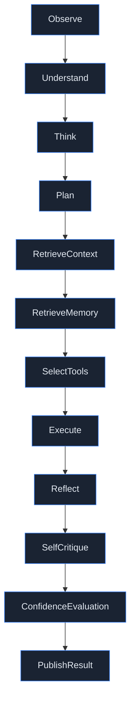

# Reasoning Engine

Every agent invocation — regardless of which of the 7 agents, regardless of task type — runs
through the same 12-stage pipeline (`ai-runtime/app/reasoning/pipeline.py`). This uniformity is
what makes the Reasoning Inspector, Telemetry Center, and Execution Playback possible: one schema
(`ReasoningTrace`) describes every agent's work, so the dashboard doesn't need agent-specific
rendering logic.

## The 12 stages

| Stage | What it does | What it can produce |
|---|---|---|
| **Observe** | Reads the dispatched task's payload (type, name, inputs). | — |
| **Understand** | Interprets the task in the context of the agent's role. | — |
| **Think** | Initial reasoning about approach. | tokens (if a real model is configured) |
| **Plan** | Decides the concrete steps to take. | — |
| **RetrieveContext** | Pulls in referenced artifacts (e.g. resolves a join node's inputs by name — see [Execution Flow](EXECUTION_FLOW.md#the-dag)). | tool calls |
| **RetrieveMemory** | Queries the relevant memory layer(s) for prior decisions/context. | memory reads |
| **SelectTools** | Chooses which registered tools (if any) this task needs. | — |
| **Execute** | Does the actual work — calls the Multi-Model Router, invokes tools. | tool calls, tokens, memory writes |
| **Reflect** | Reviews the produced output against the task's intent. | tokens |
| **SelfCritique** | A second pass looking for gaps or errors before publishing. | tokens |
| **ConfidenceEvaluation** | Assigns a 0.0–1.0 confidence score to the result — this is the number every "confidence" figure in Mission Control ultimately traces back to. | confidence score |
| **PublishResult** | Persists the artifact (if any) and marks the task complete. | artifact, task status update |

Every stage — not just `Execute` — is individually timed and persisted as one `ReasoningTrace` row
(`POST /api/reasoning/traces`), carrying: agent, stage, duration, tokens, confidence, model used,
retry count, memory reads/writes, tool calls, cost estimate, and an optional error message. This is
why the Telemetry Center can chart per-stage duration/confidence/token distributions across the
whole workspace, not just per-agent totals.

## Model routing

`Execute` (and any stage that calls a model) goes through `app/routing/model_router.py`, which:

1. Tries providers in a configured preference order (`ANTHROPIC_API_KEY` → `OPENAI_API_KEY` →
   `GEMINI_API_KEY` → `OLLAMA_HOST`).
2. Falls back to a **deterministic mock provider** if none are configured, or if a real provider
   call fails. The mock provider is not a stub that breaks the demo — it's how this entire platform
   runs end-to-end with zero external dependencies. Every screenshot and the recorded walkthrough in
   this repository were produced entirely on the mock fallback.
3. Records which model actually served each stage (`ModelUsed` on the trace), which is what the
   Agent Profile's "Model Usage" panel and the Telemetry Center's model-usage chart read from.

## Failure handling

If any stage throws, `classify_exception` (`app/reasoning/failures.py`) maps it to a
`StructuredFailure` — category, severity, whether it's retryable, and a suggested action — rather
than letting a raw exception propagate. This is the single failure-classification boundary used
uniformly across every agent (see [Code Review](../reviews/CODE_REVIEW.md)); no agent hand-rolls its
own error handling. A retryable failure re-dispatches the task (see
[Agent Lifecycle](AGENT_LIFECYCLE.md#retries)); a terminal one marks the task and eventually the run
as `Failed`.

## Where this surfaces in Mission Control

- **Reasoning Inspector** (click any node in the Execution Graph): the full 12-stage breakdown for
  that specific task, with per-stage duration/tokens/tool calls/memory reads.
- **Agent Profile**: a cross-workflow reasoning timeline — every stage this agent has ever run,
  most recent first.
- **Telemetry Center**: workspace-wide aggregates — average duration and confidence per stage,
  token/tool/memory usage totals, a confidence-distribution histogram, and a per-agent correlation
  timeline.
