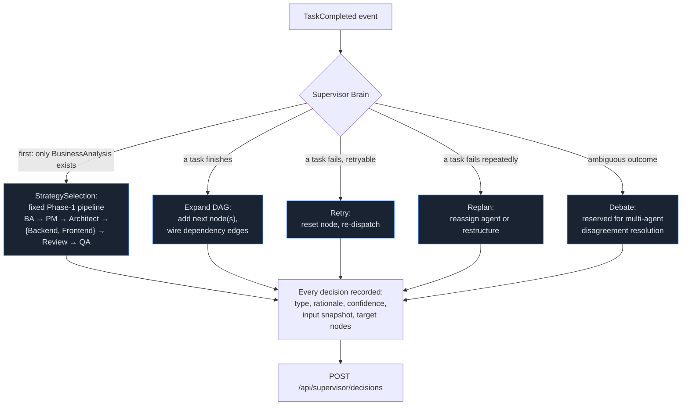

# Supervisor Brain

The Supervisor Brain (`ai-runtime/app/supervisor/supervisor_agent.py`) is what makes the workflow
DAG *dynamic* rather than a fixed template. It doesn't execute tasks itself — it watches task
completions and decides how the graph should grow or change next.

## What it does

## Decision types

| Type | When | Example (from the live demo run) |
|---|---|---|
| `StrategySelection` | Choosing the overall approach for a phase of work. | *"Phase 1 fixed pipeline: Business Analyst first; once it completes, expand the DAG with Project Manager → System Architect → {Backend, Frontend} (parallel) → Code Reviewer → QA Engineer."* — confidence 100% |
| `Replan` | Restructuring the DAG in response to new information or a failure. | Reserved; not yet triggered by any current failure path — see Roadmap. |
| `Retry` | Re-dispatching a task after a retryable failure. | Driven by `StructuredFailure.retryable` from the Reasoning Engine. |
| `Reassign` | Moving a task to a different agent. | Reserved for when the originally-assigned agent is unavailable. |
| `Debate` | Reserved for resolving disagreement between multiple agents on the same task. | Not yet implemented — see Roadmap. |

Every decision is persisted with a full input snapshot (the DAG state the Supervisor was looking at),
a human-readable rationale string, and a confidence score — not just the outcome. This is what the
Supervisor Brain dashboard page's "Decision History" and "Confidence Evolution" chart are built
from directly, and it's why a decision can be explained after the fact rather than just observed.

## Why decisions reference artifacts by name, not by ID

A join node (e.g. `CodeReview`, which depends on both `BackendImplementation` and
`FrontendImplementation`) is created *before* its parallel predecessors have finished — the
Supervisor doesn't know their artifact IDs yet at DAG-expansion time, only that the node will need
"whatever `BackendCode` and `FrontendCode` end up being." The Reasoning Engine's `RetrieveContext`
stage resolves these by name once the join node actually starts executing
(`GetLatestArtifactByNameQuery` — see [API Reference](../API.md)).

## Where this surfaces in Mission Control

- **Execution Graph → Supervisor tab**: the decision timeline for one run.
- **Supervisor Brain page**: cross-run decision history, confidence evolution across every decision
  ever made in the workspace, a decision-type breakdown, and agent-assignment load (how many tasks
  the Supervisor has routed to each agent).
