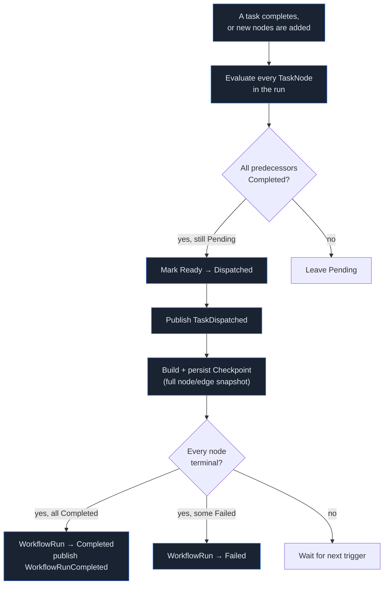

# Workflow Engine

The `.NET API`'s `SchedulerService` (`Application/Scheduling/SchedulerService.cs`) is the only
component that decides "what runs next." It's a plain domain service invoked by command handlers —
deliberately *not* a MediatR request itself, since it's driven by state changes (a task completed,
a new node was added) rather than by an external caller.

## Scheduling pass

A "ready" node is one whose every predecessor (per `TaskEdges`) is `Completed`. Nodes with no
predecessors, or whose predecessors are all done, are dispatched together — this is exactly how
`BackendImplementation` and `FrontendImplementation` end up running in parallel (see
[Execution Flow](EXECUTION_FLOW.md#the-dag)).

## Idempotency

Two idempotency guarantees matter here, both enforced at the database level, not just in
application logic:

- **Artifact production**: `Artifact` has a unique partial index on `(WorkflowRunId, IdempotencyKey)`
  where `IdempotencyKey IS NOT NULL` — a retried "produce artifact" call with the same key resolves
  to the existing row instead of creating a spurious duplicate version.
- **Task completion**: re-processing an already-`Completed` task's completion event is a no-op, not
  a double-transition — verified directly by an integration test (`WorkflowPipelineTests`, "node
  idempotency").

This matters because the event bus (see [Event Bus](EVENT_BUS.md)) is at-least-once delivery by
design — a consumer that crashes after processing but before acknowledging will see the same event
again on restart, and the system needs to handle that safely rather than assuming exactly-once.

## Checkpoints & Execution Playback

After **every** scheduling pass, `SchedulerService.BuildCheckpoint` serializes the complete current
state — every node's status, assigned agent, confidence, risk level, and attempt count, plus every
edge — into one `Checkpoint` row (`Label`, `SnapshotJson`, `CreatedAt`).

This wasn't originally built for the dashboard — it's the Phase 1.5 "Execution Snapshots"
requirement, intended for future resume/replay/debugging — but it turned out to be exactly the
right shape for Mission Control's **Execution Playback**: the frontend fetches every checkpoint for
a run (`GET /api/checkpoints`) and scrubs through them, rebuilding the Execution Graph from each
one's `SnapshotJson` in turn. The DAG shown at checkpoint 1 of 9 genuinely only has one node in it,
because that's what the graph actually looked like at that scheduling pass — not an animation
interpolating toward the final state.

## Retry & failure propagation

A `TaskFailed` event carrying a retryable `StructuredFailure` (see
[Reasoning Engine](REASONING_ENGINE.md#failure-handling)) causes the Supervisor to issue a `Retry`
decision, which the scheduler honors by resetting the node to `Ready` and incrementing
`AttemptCount`. A non-retryable failure marks the node `Failed`; whether that fails the whole run
depends on `WorkflowRun.HasUnrecoverableFailure()` — a domain method that exists but (per the
[Code Review](../reviews/CODE_REVIEW.md)) isn't yet wired into every failure path, since no failure
scenario in the current demo set has needed it.

## Where this surfaces in Mission Control

- **Execution Graph**: the live current state.
- **Execution Playback**: scrubs through real checkpoint history — see above.
- **Telemetry Center → Parallel Execution chart**: derived from each run's DAG column widths
  (the same layout the Execution Graph itself uses), so "how parallel was this run" is read
  straight from the checkpoint/graph topology, not a separate metric.
