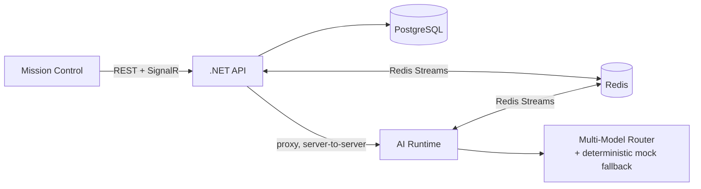
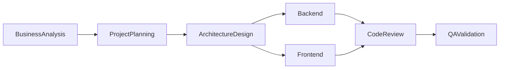

# Architecture Slides

A markdown slide outline — one `---`-separated section per slide. Paste into any markdown-to-slides
tool (Marp, Slidev, reveal-md) or present directly from this file. Pairs with
[PRESENTATION_SCRIPT.md](PRESENTATION_SCRIPT.md).

---

## AI Agents Team

An autonomous AI software engineering company, with a dashboard that shows its work.

`docker compose up -d` → zero API keys → full pipeline in under a minute.

---

## The shape of it

Three services, one job each:

- **`.NET API`** — owns all durable state, the only writer to Postgres
- **`Python AI Runtime`** — the brain: reasoning, supervisor, model routing
- **`Next.js Mission Control`** — renders everything, live

Two boundaries, both *checked*, not just documented:
AI runtime never touches the DB · dashboard never calls the AI runtime

---

## System diagram



---

## The reasoning pipeline

Every agent · every task · same 12 stages:

Observe → Understand → Think → Plan → RetrieveContext → RetrieveMemory →
SelectTools → **Execute** → Reflect → SelfCritique → ConfidenceEvaluation → PublishResult

One schema. One inspector UI. No agent-specific rendering code.

---

## The DAG is built, not templated



Starts as **one node**. The Supervisor expands it as work completes — parallel branches emerge
because the graph says they can, not because a template says so.

---

## Execution Playback

A `Checkpoint` — full DAG snapshot — written after **every** scheduling pass.

Playback scrubs through **real history**, not an animation between start and end.

---

## The honesty principle

Project Health computes real scores from real data:
Reliability · Confidence · Testing · Architecture · Documentation · Performance

Two categories — **Security, Maintainability** — have no real signal yet.

They show as **unmeasured**. Not a guess.

---

## Release 1.0 is a real review, not a checklist

- Code Review — SOLID, dead code, duplication, async correctness, file:line citations
- Security Review — no auth (by design), dependency CVEs, sandbox verification
- Performance Review — a real full-table-scan found and documented, not hidden

---

## Try it

```bash
git clone https://github.com/Ali-Khamis45/Multi-Agent-orkflow-.git
cd Multi-Agent-orkflow- && docker compose up -d
cd frontend && npm install && npm run dev
```

Click **Run demo**. No API key required.
