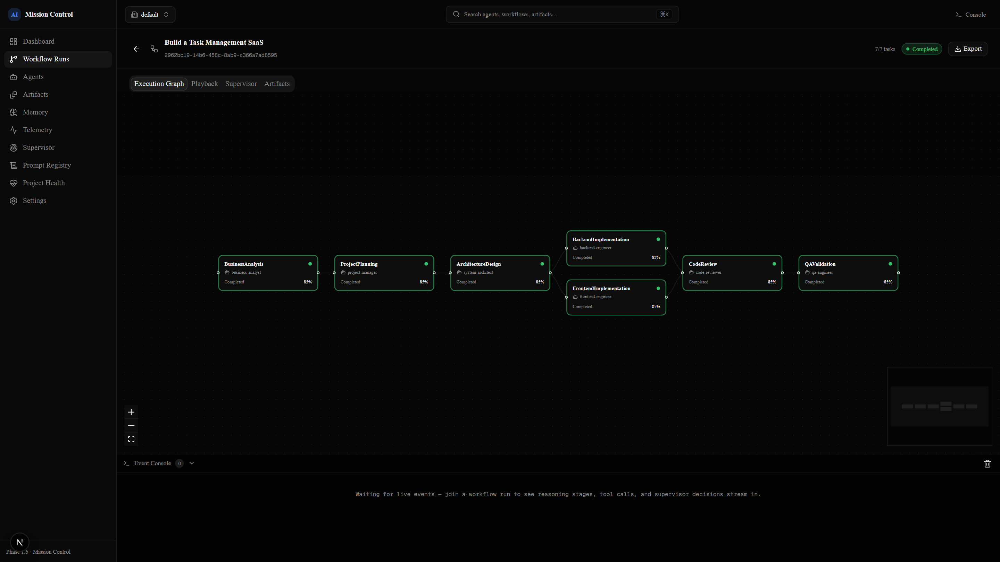
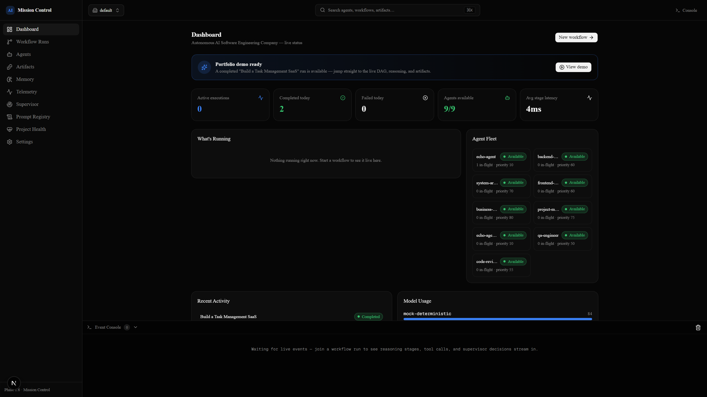
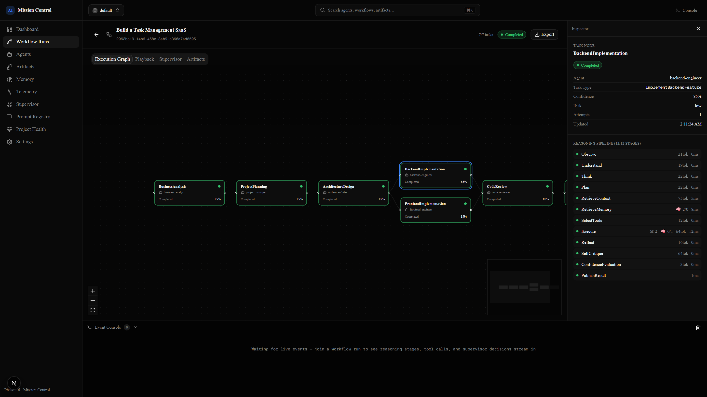
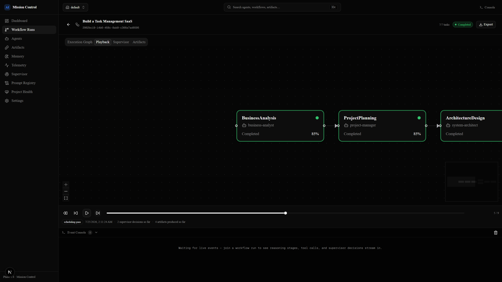
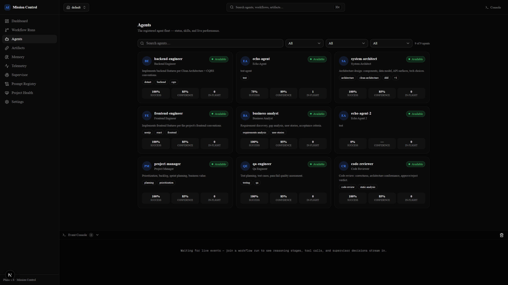
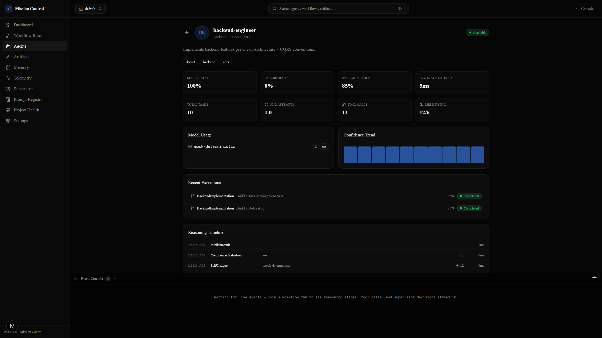
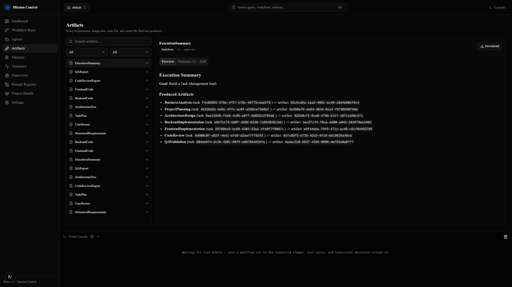
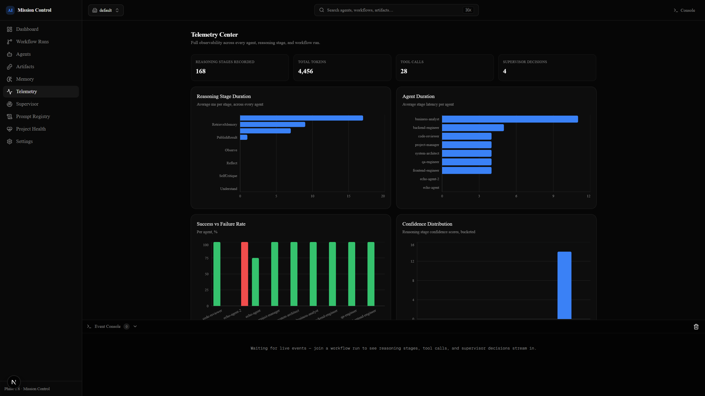
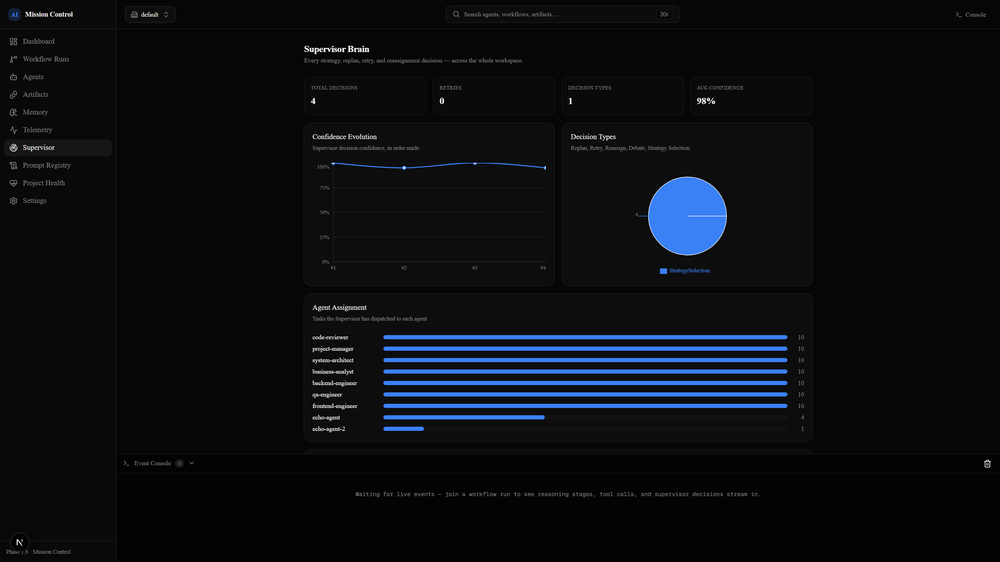
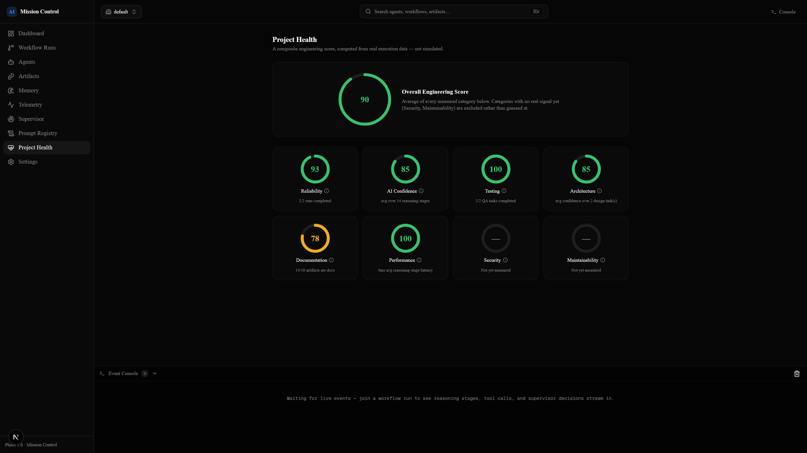

# AI Agents Team

**An autonomous AI software engineering company** — submit a one-line goal like
*"Build a Task Management SaaS"* and watch a supervised fleet of specialist
agents turn it into requirements, architecture, backend and frontend code,
a code review, and a QA pass, coordinated through a dynamically generated
DAG — with every decision, reasoning stage, and artifact observable live in
**Mission Control**, the system's own Next.js dashboard.

<p align="center">
  
</p>

<p align="center">
  <a href="docs/video/mission-control-demo.webm">▶ Watch the full walkthrough (docs/video/mission-control-demo.webm)</a>
</p>

---

## What this is

Three cooperating services:

- **`api/`** — ASP.NET Core 10 orchestration service (Clean Architecture,
  MediatR/CQRS, EF Core + PostgreSQL, SignalR). Owns all durable state
  (workflow runs, task graphs, artifacts, memory, telemetry) and is the
  **only** thing the frontend or the AI runtime is allowed to persist
  through.
- **`ai-runtime/`** — Python/FastAPI service that is the system's "brain":
  intent analysis, a 12-stage reasoning pipeline per agent invocation, the
  Supervisor Brain (which dynamically expands the task DAG as work
  completes), a multi-model router (falls back to a deterministic mock
  provider if no API key is configured — the whole system runs end-to-end
  with zero external dependencies), and seven specialist agents (Business
  Analyst, Project Manager, System Architect, Backend/Frontend Engineer,
  Code Reviewer, QA Engineer).
- **`frontend/`** — **Mission Control**, a Next.js 16 / React 19 dashboard.
  It talks *only* to the ASP.NET API and its SignalR hub — never to the
  Python runtime directly — and renders everything the platform does:
  the live execution graph, per-agent reasoning traces, supervisor
  decisions, artifacts, memory, telemetry, and more.

See [ARCHITECTURE.md](ARCHITECTURE.md) for the full design and phased build
order, [ARCHITECTURE_EXTENSION.md](ARCHITECTURE_EXTENSION.md) for the
16-subsystem enterprise extension layer this was built additively toward,
[PHASE_1_5_HARDENING.md](PHASE_1_5_HARDENING.md) for the production-hardening
pass, and [PERFORMANCE_BASELINE.md](PERFORMANCE_BASELINE.md) for measured
performance numbers.

## Quick start

```bash
git clone https://github.com/Ali-Khamis45/Multi-Agent-orkflow-.git
cd Multi-Agent-orkflow-
docker compose up -d          # postgres, redis, api, ai-runtime
cd frontend
cp .env.example .env.local
npm install
npm run dev                   # http://localhost:3000
```

No API keys are required. `ai-runtime`'s Multi-Model Router runs entirely on
a deterministic mock provider unless `ANTHROPIC_API_KEY` / `OPENAI_API_KEY` /
`GEMINI_API_KEY` / `OLLAMA_HOST` is set (see `ai-runtime/.env.example`), so a
fresh clone can run a full pipeline immediately.

**Fastest way to see it work:** open the dashboard and click **Run demo** on
the Portfolio Demo banner — it submits *"Build a Task Management SaaS"* to
the real intake pipeline and follows the run live. It completes in well
under a minute.

## Mission Control tour

| | |
|---|---|
|  **Dashboard** — live counts, agent fleet, recent activity, model usage. |  **Execution Graph** — the DAG, live via SignalR. Parallel branches (e.g. Backend + Frontend) render in the same column via a from-scratch layered layout. |
|  **Reasoning Inspector** — click any node for its full 12-stage pipeline: tokens, tool calls, memory reads/writes, duration. |  **Execution Playback** — scrub through a run's *real* checkpoint history (one snapshot per scheduling pass); the graph genuinely rebuilds itself at each historical state. |
|  **Agents** — the registry, filterable by status/role/skill. |  **Agent Profile** — live stats, model usage, confidence trend, recent executions, cross-workflow reasoning timeline. |
|  **Artifacts Explorer** — GitHub-like browser: search, Monaco code viewer, rendered Markdown, version history, Monaco diff view. |  **Telemetry Center** — 11 charts: stage duration, agent duration, success/failure, confidence distribution, tool/memory usage, retries, token/model usage, workflow duration, DAG parallelism. |
|  **Supervisor Brain** — cross-run decision history, confidence evolution, decision-type breakdown, agent assignment load. |  **Project Health** — a composite engineering score computed from real execution data. Categories with no real signal (Security, Maintainability) are shown as unmeasured, never guessed at. |

Also included: a **Memory Inspector** (five-layer breakdown, relationships to
source artifacts, version/supersession history), a **Prompt Registry**
(every versioned prompt, its variables, and owning agent), a **Ctrl+K
command palette** that searches agents/runs/artifacts/prompts and can replay
a past run, and an **export menu** on every run (execution summary, graph,
artifacts, reasoning trace, and telemetry as JSON or Markdown).

## Tech stack

**Backend:** ASP.NET Core 10 · MediatR/CQRS · EF Core + Npgsql · FluentValidation · SignalR · Redis Streams (event bus)
**AI runtime:** Python 3 · FastAPI · async agent framework · multi-model router with mock fallback
**Frontend:** Next.js 16 (App Router) · React 19 · TypeScript · Tailwind CSS v4 · shadcn/ui (Base UI) · React Flow · Framer Motion · TanStack Query · Zustand · Monaco Editor · Recharts
**Infra:** PostgreSQL · Redis · Docker Compose

## Project structure

```
api/            ASP.NET Core orchestration service (Clean Architecture)
  Domain/       Entities, aggregates, domain logic
  Application/  CQRS queries/commands, DTOs
  Infrastructure/  EF Core, Redis, AI-runtime HTTP client
  Api/          Controllers, SignalR hubs, composition root
ai-runtime/     Python FastAPI "brain" — agents, reasoning pipeline, Supervisor Brain
frontend/       Mission Control — Next.js dashboard
docs/           Screenshots and demo video for this README
```

## Roadmap

Explicitly **not** built yet — called out in the product itself rather than
hidden, wherever the UI has a natural place to say so:

- **Vector Memory / Knowledge Graph** — the memory schema already carries a
  `Score` field for embedding-similarity ranking; retrieval is still
  recency-ordered, not semantic.
- **Security Analyzer** — no static vulnerability scanning subsystem yet,
  so Project Health reports Security as unmeasured rather than a guess.
- **Maintainability analysis** — no lint/static-analysis integration over
  generated code yet, same treatment.
- **Distributed agent execution** — agents currently run in-process in the
  Python runtime; the registry's `endpoint` field is wired for a future
  distributed deployment but not load-bearing yet.
- **Real LLM providers in CI/demo** — the shipped default is the
  deterministic mock router; wiring a real provider is a one-line env var
  away (`ANTHROPIC_API_KEY` etc.) but not exercised by the demo path.

## License

[MIT](LICENSE)
